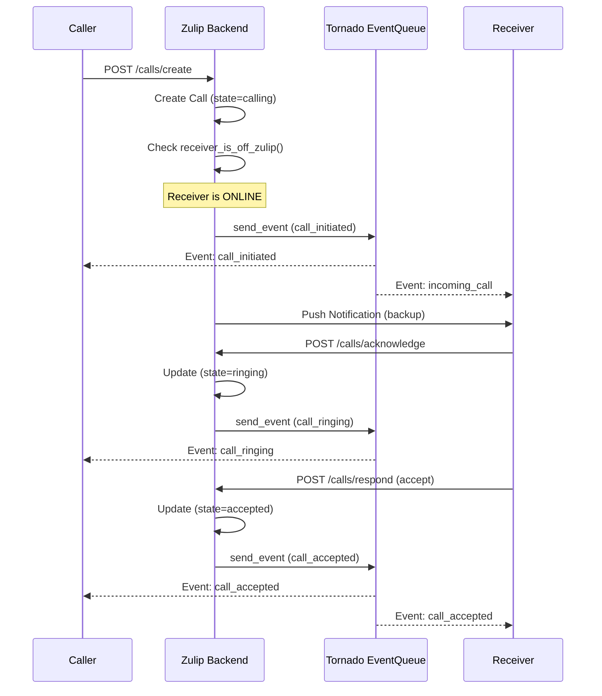
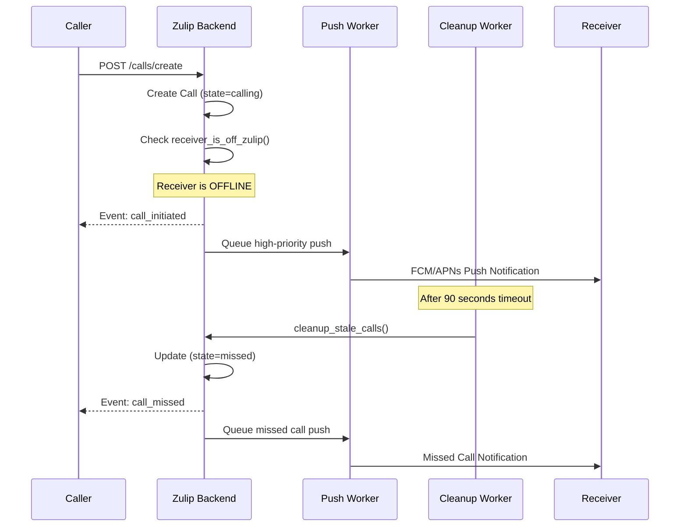
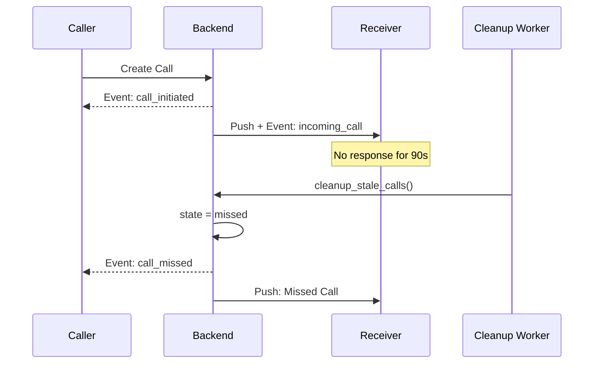
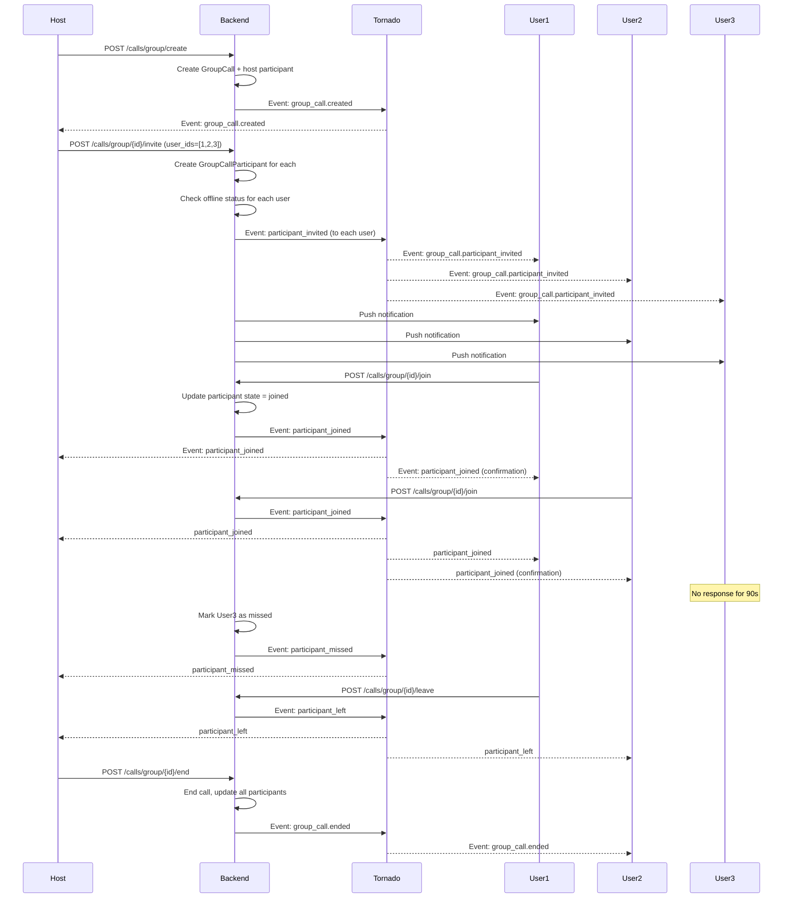

# Call Events Server Integration Plan

## Problem Analysis

The current call implementation has these issues:

1. **No event schema** - Call events are not defined in `zerver/lib/event_types.py`
2. **No frontend handler** - `web/src/server_events_dispatch.js` has no case for `call_event`
3. **Incomplete event coverage** - Events only sent after acknowledgment, not at call creation
4. **Not following Zulip patterns** - Should use action functions like `zerver/actions/typing.py`
5. **No offline detection** - Does not check if receiver is offline before attempting real-time events
6. **Missed call timing** - `cleanup_stale_calls()` exists but needs proper scheduling

## Architecture Overview

### Normal Call Flow (Receiver Online)



### Offline User Flow (Receiver Offline)



### Missed Call Flow



## Implementation Steps

### Step 1: Define Event Schema

Add call event types to [zerver/lib/event_types.py](zerver/lib/event_types.py):

```python
class CallParticipant(BaseModel):
    user_id: int
    full_name: str

class EventCall(BaseEvent):
    type: Literal["call"]
    op: Literal["initiated", "ringing", "accepted", "declined", "ended", "cancelled", "missed"]
    call_id: str
    call_type: Literal["audio", "video"]
    sender: CallParticipant
    receiver: CallParticipant
    state: str
    jitsi_url: str | None = None
    timestamp: str
```

### Step 2: Create Action Functions with Offline Detection

Create new file [zulip_calls_plugin/actions.py](zulip_calls_plugin/actions.py) following the typing.py pattern:

```python
from zerver.tornado.django_api import send_event_on_commit
from zerver.tornado.event_queue import receiver_is_off_zulip

def is_user_offline(user_id: int) -> bool:
    """Check if user is offline using Zulip's presence system"""
    return receiver_is_off_zulip(user_id)

def do_send_call_event(
    realm: Realm,
    call: Call,
    op: str,  # "initiated", "ringing", "accepted", etc.
    user_ids_to_notify: list[int],
    extra_data: dict | None = None,
) -> None:
    """Send call event via Zulip's event system"""
    event = dict(
        type="call",
        op=op,
        call_id=str(call.call_id),
        call_type=call.call_type,
        sender={"user_id": call.sender.id, "full_name": call.sender.full_name},
        receiver={"user_id": call.receiver.id, "full_name": call.receiver.full_name},
        state=call.state,
        jitsi_url=call.jitsi_room_url,
        timestamp=timezone.now().isoformat(),
    )
    if extra_data:
        event.update(extra_data)
    send_event_on_commit(realm, event, user_ids_to_notify)

def do_initiate_call(realm: Realm, call: Call) -> dict:
    """
    Handle call initiation with offline detection.
    Returns status dict with receiver_online flag.
    """
    receiver_offline = is_user_offline(call.receiver.id)
    
    # Always send event to caller
    do_send_call_event(realm, call, "initiated", [call.sender.id])
    
    # Send event to receiver (queued if offline, delivered if online)
    do_send_call_event(
        realm, call, "incoming_call", [call.receiver.id],
        extra_data={"receiver_was_offline": receiver_offline}
    )
    
    # Always send push notification (for mobile/offline)
    send_call_push_notification(call.receiver, call)
    
    return {"receiver_online": not receiver_offline}

def do_send_missed_call_event(realm: Realm, call: Call) -> None:
    """Send missed call events to both parties"""
    # Notify caller that call was missed
    do_send_call_event(
        realm, call, "missed", [call.sender.id],
        extra_data={"reason": "no_answer", "timeout_seconds": 90}
    )
    # Send missed call push to receiver
    send_missed_call_notification(call.receiver, call)
```

### Step 3: Create Missed Call Cleanup Worker

Create or update [zulip_calls_plugin/worker.py](zulip_calls_plugin/worker.py) for periodic cleanup:

```python
from zerver.worker.base import QueueProcessingWorker
from zerver.lib.queue import assign_queue

@assign_queue("call_cleanup")
class CallCleanupWorker(QueueProcessingWorker):
    """Worker to clean up stale/missed calls"""
    
    def consume(self, event: dict) -> None:
        from zulip_calls_plugin.views.calls import cleanup_stale_calls
        cleanup_stale_calls()
```

**Alternative: Use Django management command with cron/systemd timer:**

```python
# zulip_calls_plugin/management/commands/cleanup_calls.py
from django.core.management.base import BaseCommand
from zulip_calls_plugin.views.calls import cleanup_stale_calls

class Command(BaseCommand):
    help = "Clean up stale and missed calls"
    
    def handle(self, *args, **options):
        count = cleanup_stale_calls()
        self.stdout.write(f"Cleaned up {count} stale calls")
```

**Systemd timer (run every 30 seconds):**

```ini
# /etc/systemd/system/zulip-call-cleanup.timer
[Unit]
Description=Cleanup stale Zulip calls

[Timer]
OnBootSec=30s
OnUnitActiveSec=30s

[Install]
WantedBy=timers.target
```

### Step 4: Add Frontend Handler

Update [web/src/server_events_dispatch.js](web/src/server_events_dispatch.js) to handle call events:

```javascript
import * as call_events from "./call_events.ts";

// In dispatch_normal_event switch statement:
case "call":
    call_events.dispatch_call_event(event);
    break;
```

### Step 5: Create Frontend Call Events Module

Create new file [web/src/call_events.ts](web/src/call_events.ts):

```typescript
interface CallEvent {
    type: "call";
    op: string;
    call_id: string;
    call_type: "audio" | "video";
    sender: {user_id: number; full_name: string};
    receiver: {user_id: number; full_name: string};
    state: string;
    jitsi_url: string | null;
    timestamp: string;
    reason?: string;
    receiver_was_offline?: boolean;
}

export function dispatch_call_event(event: CallEvent): void {
    switch (event.op) {
        case "initiated":
            handle_call_initiated(event);
            break;
        case "incoming_call":
            handle_incoming_call(event);
            break;
        case "ringing":
            handle_call_ringing(event);
            break;
        case "accepted":
            handle_call_accepted(event);
            break;
        case "declined":
            handle_call_declined(event);
            break;
        case "ended":
        case "cancelled":
            handle_call_ended(event);
            break;
        case "missed":
            handle_call_missed(event);
            break;
    }
}

function handle_call_missed(event: CallEvent): void {
    // Show missed call notification to caller
    // Update call UI to show "No answer"
    notifications.notify({
        title: "Missed Call",
        content: `${event.receiver.full_name} didn't answer`,
    });
}

function handle_incoming_call(event: CallEvent): void {
    // Show incoming call UI overlay
    // Play ringtone
    // Show accept/decline buttons
}
```

### Step 6: Update Call Views with Offline-Aware Logic

Refactor [zulip_calls_plugin/views/calls.py](zulip_calls_plugin/views/calls.py):

```python
# In create_call() - replace current notification logic:
from zulip_calls_plugin.actions import do_initiate_call, is_user_offline

@authenticated_rest_api_view(["POST"])
def create_call(request, user_profile):
    # ... existing validation ...
    
    # Create call record
    call = Call.objects.create(
        sender=user_profile,
        receiver=recipient,
        call_type=call_type,
        state="calling",
        # ...
    )
    
    # Use new action function with offline detection
    status = do_initiate_call(user_profile.realm, call)
    
    return json_success(request, data={
        "call_id": str(call.call_id),
        "receiver_online": status["receiver_online"],
        # ...
    })
```

**Update cleanup_stale_calls() to use action functions:**

```python
def cleanup_stale_calls() -> int:
    from zulip_calls_plugin.actions import do_send_missed_call_event
    
    # ... existing timeout logic ...
    
    for call in unanswered_calls:
        call.state = 'missed'
        call.ended_at = now
        call.save()
        
        # Use new action function
        do_send_missed_call_event(call.sender.realm, call)
        
        CallEvent.objects.create(
            call=call,
            event_type='missed',
            user=call.sender,
            metadata={'reason': 'unanswered_timeout', 'timeout_seconds': 90}
        )
        count += 1
    
    return count
```

### Step 7: Remove Old send_call_event Function

Delete the current `send_call_event()` function from `views/calls.py` (lines 443-478) after migrating to the new action-based approach.

## Key Files to Modify

| File | Changes |

|------|---------|

| `zerver/lib/event_types.py` | Add `CallParticipant` and `EventCall` schemas |

| `zulip_calls_plugin/actions.py` | New file with `do_send_call_event()`, `do_initiate_call()`, offline detection |

| `zulip_calls_plugin/views/calls.py` | Use action functions, add offline-aware event dispatch |

| `zulip_calls_plugin/worker.py` | New file for call cleanup worker (or management command) |

| `web/src/server_events_dispatch.js` | Add `case "call":` handler |

| `web/src/call_events.ts` | New file for frontend event handling including missed calls |

## Event Coverage Matrix

| Scenario | State | Event Op | To Sender | To Receiver | Push |

|----------|-------|----------|-----------|-------------|------|

| Call created | calling | initiated | Yes | - | - |

| Call created | calling | incoming_call | - | Yes (queued if offline) | Yes |

| Acknowledged | ringing | ringing | Yes | - | - |

| Accepted | accepted | accepted | Yes | Yes | - |

| Declined | rejected | declined | Yes | Yes | - |

| Ended normally | ended | ended | Yes | Yes | - |

| Caller cancels | cancelled | cancelled | - | Yes | - |

| **No answer (90s)** | missed | missed | Yes | - | Yes (missed call) |

| **Receiver offline** | calling | incoming_call | - | Queued | Yes (high priority) |

| **Network failure** | network_failure | ended | Yes | Yes | - |

| **Stale (10 min)** | timeout | ended | Yes | Yes | - |

## Offline User Handling

**Detection**: Use `receiver_is_off_zulip()` from `zerver/tornado/event_queue.py`

**Behavior when receiver is offline:**

1. Event is still sent via `send_event_on_commit()` - it gets queued in Tornado
2. Push notification is sent immediately (FCM/APNs)
3. If receiver comes online within 90s, they receive queued event
4. If no response in 90s, `cleanup_stale_calls()` marks as missed

**Return to caller:**

```python
# Caller knows receiver status immediately
{
    "call_id": "uuid",
    "receiver_online": false,  # Caller can show "User may be offline"
    ...
}
```

## Missed Call Scenarios

| Trigger | Timeout | Action |

|---------|---------|--------|

| No acknowledge | 90 seconds | Mark missed, notify sender, push to receiver |

| No heartbeat (active call) | 60 seconds | Mark network_failure, notify both |

| Stale call | 10 minutes | Mark timeout, notify both |

**Cleanup Worker Scheduling:**

- Run `cleanup_stale_calls()` every 30 seconds
- Options: Django management command + cron, systemd timer, or RabbitMQ worker

## Testing Considerations

1. **Online scenarios:**

   - Test WebSocket event delivery for all state transitions
   - Verify events reach correct participants (sender vs receiver)
   - Test with multiple concurrent calls
   - Verify frontend UI updates on event receipt

2. **Offline scenarios:**

   - Test with receiver having no active event queues
   - Verify push notification is sent when receiver offline
   - Test event queue delivery when receiver comes back online
   - Verify `receiver_online: false` is returned to caller

3. **Missed call scenarios:**

   - Test 90-second timeout triggers missed state
   - Verify missed call push notification sent to receiver
   - Verify missed event sent to caller
   - Test cleanup worker runs correctly on schedule

4. **Edge cases:**

   - Receiver goes offline during ringing
   - Network failure during active call
   - Multiple calls to same offline user
   - Cleanup running during active call operations

---

## Group Call Support

### New Models

Add to [zulip_calls_plugin/models/calls.py](zulip_calls_plugin/models/calls.py):

```python
class GroupCall(models.Model):
    """Model for managing group video/voice calls"""
    
    CALL_TYPES = [
        ("video", "Video Call"),
        ("audio", "Audio Call"),
    ]
    
    CALL_STATES = [
        ("active", "Active"),
        ("ended", "Ended"),
    ]
    
    call_id = models.UUIDField(primary_key=True, default=uuid.uuid4, db_index=True)
    call_type = models.CharField(max_length=10, choices=CALL_TYPES)
    state = models.CharField(max_length=20, choices=CALL_STATES, default="active")
    
    # Creator/host of the call
    host = models.ForeignKey(
        UserProfile, on_delete=models.CASCADE, related_name="hosted_group_calls"
    )
    
    # Associated stream/topic or DM group (optional)
    stream = models.ForeignKey(
        Stream, on_delete=models.SET_NULL, null=True, blank=True
    )
    topic = models.CharField(max_length=255, null=True, blank=True)
    
    # Call details
    jitsi_room_name = models.CharField(max_length=255)
    jitsi_room_url = models.URLField()
    max_participants = models.IntegerField(default=50)
    
    # Timestamps
    created_at = models.DateTimeField(auto_now_add=True)
    ended_at = models.DateTimeField(null=True, blank=True)
    
    # Metadata
    realm = models.ForeignKey(Realm, on_delete=models.CASCADE)
    title = models.CharField(max_length=255, null=True, blank=True)
    
    class Meta:
        app_label = "zulip_calls_plugin"
        ordering = ["-created_at"]


class GroupCallParticipant(models.Model):
    """Track participants in a group call"""
    
    PARTICIPANT_STATES = [
        ("invited", "Invited"),
        ("ringing", "Ringing"),
        ("joined", "Joined"),
        ("declined", "Declined"),
        ("left", "Left"),
        ("missed", "Missed"),
    ]
    
    call = models.ForeignKey(
        GroupCall, on_delete=models.CASCADE, related_name="participants"
    )
    user = models.ForeignKey(
        UserProfile, on_delete=models.CASCADE, related_name="group_call_participations"
    )
    state = models.CharField(max_length=20, choices=PARTICIPANT_STATES, default="invited")
    is_host = models.BooleanField(default=False)
    
    # Timestamps
    invited_at = models.DateTimeField(auto_now_add=True)
    joined_at = models.DateTimeField(null=True, blank=True)
    left_at = models.DateTimeField(null=True, blank=True)
    
    # Heartbeat tracking
    last_heartbeat = models.DateTimeField(null=True, blank=True)
    
    class Meta:
        app_label = "zulip_calls_plugin"
        unique_together = [["call", "user"]]
```

### Group Call Event Schema

Add to [zerver/lib/event_types.py](zerver/lib/event_types.py):

```python
class GroupCallParticipantInfo(BaseModel):
    user_id: int
    full_name: str
    state: str
    is_host: bool

class EventGroupCall(BaseEvent):
    type: Literal["group_call"]
    op: Literal["created", "participant_invited", "participant_joined", 
                "participant_left", "participant_declined", "ended"]
    call_id: str
    call_type: Literal["audio", "video"]
    host: CallParticipant
    participants: list[GroupCallParticipantInfo]
    jitsi_url: str
    title: str | None = None
    stream_id: int | None = None
    topic: str | None = None
    timestamp: str
```

### Group Call API Endpoints

Add to [zulip_calls_plugin/urls/calls.py](zulip_calls_plugin/urls/calls.py):

```python
# Group call endpoints
path("api/v1/calls/group/create", create_group_call, name="create_group_call"),
path("api/v1/calls/group/<str:call_id>/invite", invite_to_group_call, name="invite_to_group_call"),
path("api/v1/calls/group/<str:call_id>/join", join_group_call, name="join_group_call"),
path("api/v1/calls/group/<str:call_id>/leave", leave_group_call, name="leave_group_call"),
path("api/v1/calls/group/<str:call_id>/end", end_group_call, name="end_group_call"),
path("api/v1/calls/group/<str:call_id>/status", get_group_call_status, name="get_group_call_status"),
path("api/v1/calls/group/<str:call_id>/participants", get_group_call_participants, name="get_group_call_participants"),
```

### Group Call Flow



### Group Call Action Functions

Add to [zulip_calls_plugin/actions.py](zulip_calls_plugin/actions.py):

```python
def do_send_group_call_event(
    realm: Realm,
    group_call: GroupCall,
    op: str,
    user_ids_to_notify: list[int],
    extra_data: dict | None = None,
) -> None:
    """Send group call event via Zulip's event system"""
    participants = [
        {
            "user_id": p.user.id,
            "full_name": p.user.full_name,
            "state": p.state,
            "is_host": p.is_host,
        }
        for p in group_call.participants.all()
    ]
    
    event = dict(
        type="group_call",
        op=op,
        call_id=str(group_call.call_id),
        call_type=group_call.call_type,
        host={"user_id": group_call.host.id, "full_name": group_call.host.full_name},
        participants=participants,
        jitsi_url=group_call.jitsi_room_url,
        title=group_call.title,
        stream_id=group_call.stream_id if group_call.stream else None,
        topic=group_call.topic,
        timestamp=timezone.now().isoformat(),
    )
    if extra_data:
        event.update(extra_data)
    send_event_on_commit(realm, event, user_ids_to_notify)


def do_invite_to_group_call(
    realm: Realm,
    group_call: GroupCall,
    inviter: UserProfile,
    invited_users: list[UserProfile],
) -> dict:
    """Invite users to a group call with offline detection"""
    results = {"invited": [], "offline": []}
    
    for user in invited_users:
        # Create participant record
        participant, _ = GroupCallParticipant.objects.get_or_create(
            call=group_call,
            user=user,
            defaults={"state": "invited"}
        )
        
        is_offline = is_user_offline(user.id)
        
        # Send event to the invited user
        do_send_group_call_event(
            realm, group_call, "participant_invited", [user.id],
            extra_data={"inviter_id": inviter.id, "was_offline": is_offline}
        )
        
        # Send push notification
        send_group_call_push_notification(user, group_call, inviter)
        
        if is_offline:
            results["offline"].append(user.id)
        else:
            results["invited"].append(user.id)
    
    # Notify existing participants about new invites
    existing_participant_ids = list(
        group_call.participants.filter(state="joined").values_list("user_id", flat=True)
    )
    if existing_participant_ids:
        do_send_group_call_event(
            realm, group_call, "participants_invited", existing_participant_ids,
            extra_data={"new_participants": [u.id for u in invited_users]}
        )
    
    return results
```

### Group Call Event Coverage

| Scenario | Event Op | Recipients | Push |

|----------|----------|------------|------|

| Call created | created | Host | - |

| User invited | participant_invited | Invited user | Yes |

| User joins | participant_joined | All active participants | - |

| User leaves | participant_left | All active participants | - |

| User declines | participant_declined | Host | - |

| User missed (timeout) | participant_missed | Host | Yes (to user) |

| Call ended by host | ended | All participants | - |

| Participant kicked | participant_removed | Kicked user + others | - |

---

## Flutter Integration Documentation

Create new file [zulip_calls_plugin/docs/FLUTTER_CALL_EVENTS_INTEGRATION.md](zulip_calls_plugin/docs/FLUTTER_CALL_EVENTS_INTEGRATION.md):

### Flutter Call Events Integration Guide

````markdown
# Flutter Call Events Integration Guide

Complete guide for integrating Zulip call events with a Flutter mobile application.

## Overview

This guide covers:
1. Real-time call events via Zulip's event system
2. 1-to-1 calls and group calls
3. Offline handling and missed calls
4. Push notification integration

## Event Types

### 1-to-1 Call Events

| Event Type | Op | Description |
|------------|-----|-------------|
| `call` | `initiated` | Call created (to caller) |
| `call` | `incoming_call` | Incoming call (to receiver) |
| `call` | `ringing` | Receiver acknowledged (to caller) |
| `call` | `accepted` | Call accepted (to both) |
| `call` | `declined` | Call declined (to both) |
| `call` | `ended` | Call ended (to both) |
| `call` | `cancelled` | Caller cancelled (to receiver) |
| `call` | `missed` | Call missed (to caller) |

### Group Call Events

| Event Type | Op | Description |
|------------|-----|-------------|
| `group_call` | `created` | Group call created |
| `group_call` | `participant_invited` | User invited |
| `group_call` | `participant_joined` | User joined |
| `group_call` | `participant_left` | User left |
| `group_call` | `participant_declined` | User declined |
| `group_call` | `participant_missed` | User missed (timeout) |
| `group_call` | `ended` | Call ended by host |

## Setup

### 1. Dependencies

```yaml
dependencies:
  http: ^1.1.0
  web_socket_channel: ^2.4.0
  jitsi_meet_flutter_sdk: ^10.0.0
  firebase_messaging: ^14.7.0
  flutter_callkit_incoming: ^2.0.0  # For iOS CallKit
````

### 2. Register for Call Events

```dart
class ZulipEventService {
  static const String baseUrl = 'https://your-zulip-domain.com';
  
  Future<Map<String, dynamic>> registerForEvents() async {
    final response = await http.post(
      Uri.parse('$baseUrl/api/v1/register'),
      headers: authHeaders,
      body: jsonEncode({
        'event_types': ['call', 'group_call'],  // Register for call events
        'client_capabilities': {
          'notification_settings_null': false,
        }
      }),
    );
    return jsonDecode(response.body);
  }
}
```

### 3. Event Polling

```dart
class CallEventPoller {
  Timer? _pollTimer;
  String? _queueId;
  int _lastEventId = -1;
  
  final StreamController<CallEvent> _eventController = 
      StreamController<CallEvent>.broadcast();
  
  Stream<CallEvent> get events => _eventController.stream;
  
  Future<void> startPolling() async {
    final registration = await ZulipEventService.registerForEvents();
    _queueId = registration['queue_id'];
    _lastEventId = registration['last_event_id'];
    
    _poll();
  }
  
  Future<void> _poll() async {
    try {
      final response = await http.get(
        Uri.parse(
          '${ZulipEventService.baseUrl}/api/v1/events'
          '?queue_id=$_queueId&last_event_id=$_lastEventId'
        ),
        headers: authHeaders,
      ).timeout(Duration(seconds: 90));
      
      final data = jsonDecode(response.body);
      
      for (final event in data['events']) {
        _lastEventId = event['id'];
        
        if (event['type'] == 'call' || event['type'] == 'group_call') {
          _eventController.add(CallEvent.fromJson(event));
        }
      }
    } catch (e) {
      // Handle timeout or error
    }
    
    // Continue polling
    _poll();
  }
}
```

## Call Event Models

```dart
class CallEvent {
  final String type;      // 'call' or 'group_call'
  final String op;        // 'initiated', 'incoming_call', etc.
  final String callId;
  final String callType;  // 'audio' or 'video'
  final CallParticipant sender;
  final CallParticipant? receiver;
  final List<GroupCallParticipant>? participants;
  final String? jitsiUrl;
  final String state;
  final String timestamp;
  final bool? receiverWasOffline;
  final String? reason;
  
  factory CallEvent.fromJson(Map<String, dynamic> json) {
    return CallEvent(
      type: json['type'],
      op: json['op'],
      callId: json['call_id'],
      callType: json['call_type'],
      sender: CallParticipant.fromJson(json['sender']),
      receiver: json['receiver'] != null 
          ? CallParticipant.fromJson(json['receiver']) 
          : null,
      participants: json['participants']?.map<GroupCallParticipant>(
          (p) => GroupCallParticipant.fromJson(p)).toList(),
      jitsiUrl: json['jitsi_url'],
      state: json['state'],
      timestamp: json['timestamp'],
      receiverWasOffline: json['receiver_was_offline'],
      reason: json['reason'],
    );
  }
}

class CallParticipant {
  final int userId;
  final String fullName;
  
  factory CallParticipant.fromJson(Map<String, dynamic> json) {
    return CallParticipant(
      userId: json['user_id'],
      fullName: json['full_name'],
    );
  }
}
```

## Call State Management

```dart
class CallStateManager extends ChangeNotifier {
  Call? _activeCall;
  GroupCall? _activeGroupCall;
  CallStatus _status = CallStatus.idle;
  
  Call? get activeCall => _activeCall;
  GroupCall? get activeGroupCall => _activeGroupCall;
  CallStatus get status => _status;
  
  void handleCallEvent(CallEvent event) {
    switch (event.op) {
      case 'initiated':
        _handleCallInitiated(event);
        break;
      case 'incoming_call':
        _handleIncomingCall(event);
        break;
      case 'ringing':
        _handleCallRinging(event);
        break;
      case 'accepted':
        _handleCallAccepted(event);
        break;
      case 'declined':
      case 'ended':
      case 'cancelled':
      case 'missed':
        _handleCallEnded(event);
        break;
    }
    notifyListeners();
  }
  
  void _handleIncomingCall(CallEvent event) {
    _activeCall = Call(
      callId: event.callId,
      callType: event.callType,
      sender: event.sender,
      receiver: event.receiver!,
      jitsiUrl: event.jitsiUrl,
      state: 'incoming',
    );
    _status = CallStatus.incoming;
    
    // Show incoming call UI
    _showIncomingCallUI(event);
  }
  
  void _handleCallAccepted(CallEvent event) {
    if (_activeCall?.callId == event.callId) {
      _activeCall = _activeCall!.copyWith(
        state: 'accepted',
        jitsiUrl: event.jitsiUrl,
      );
      _status = CallStatus.active;
      
      // Join Jitsi meeting
      _joinJitsiMeeting(event.jitsiUrl!);
    }
  }
  
  void _handleCallEnded(CallEvent event) {
    if (_activeCall?.callId == event.callId) {
      _activeCall = null;
      _status = CallStatus.idle;
      
      // Show missed call notification if applicable
      if (event.op == 'missed') {
        _showMissedCallNotification(event);
      }
    }
  }
}

enum CallStatus { idle, outgoing, incoming, ringing, active }
```

## Push Notification Handling

```dart
class CallPushHandler {
  static void setupFirebaseMessaging() {
    FirebaseMessaging.onMessage.listen(_handleForegroundMessage);
    FirebaseMessaging.onBackgroundMessage(_handleBackgroundMessage);
  }
  
  static void _handleForegroundMessage(RemoteMessage message) {
    if (message.data['event'] == 'call') {
      // Show incoming call UI
      _showIncomingCallScreen(message.data);
    } else if (message.data['event'] == 'missed_call') {
      // Show missed call notification
      _showMissedCallNotification(message.data);
    } else if (message.data['event'] == 'group_call') {
      // Show group call invitation
      _showGroupCallInvitation(message.data);
    }
  }
  
  @pragma('vm:entry-point')
  static Future<void> _handleBackgroundMessage(RemoteMessage message) async {
    if (message.data['event'] == 'call') {
      // Use flutter_callkit_incoming for iOS
      await FlutterCallkitIncoming.showCallkitIncoming(
        CallKitParams(
          id: message.data['call_id'],
          nameCaller: message.data['sender_full_name'],
          type: message.data['call_type'] == 'video' ? 1 : 0,
          extra: message.data,
        ),
      );
    }
  }
}
```

## API Calls

### Create 1-to-1 Call

```dart
Future<CallResponse> createCall({
  required String recipientEmail,
  required bool isVideo,
}) async {
  final response = await http.post(
    Uri.parse('$baseUrl/api/v1/calls/create'),
    headers: authHeaders,
    body: {
      'recipient_email': recipientEmail,
      'call_type': isVideo ? 'video' : 'audio',
    },
  );
  
  final data = jsonDecode(response.body);
  return CallResponse(
    callId: data['call_id'],
    jitsiUrl: data['call_url'],
    receiverOnline: data['receiver_online'],  // New field!
  );
}
```

### Respond to Call

```dart
Future<void> respondToCall(String callId, bool accept) async {
  await http.post(
    Uri.parse('$baseUrl/api/v1/calls/$callId/respond'),
    headers: authHeaders,
    body: {'response': accept ? 'accept' : 'decline'},
  );
}
```

### Create Group Call

```dart
Future<GroupCallResponse> createGroupCall({
  required String callType,
  String? title,
  int? streamId,
  String? topic,
}) async {
  final response = await http.post(
    Uri.parse('$baseUrl/api/v1/calls/group/create'),
    headers: authHeaders,
    body: {
      'call_type': callType,
      if (title != null) 'title': title,
      if (streamId != null) 'stream_id': streamId.toString(),
      if (topic != null) 'topic': topic,
    },
  );
  return GroupCallResponse.fromJson(jsonDecode(response.body));
}

Future<void> inviteToGroupCall(String callId, List<int> userIds) async {
  await http.post(
    Uri.parse('$baseUrl/api/v1/calls/group/$callId/invite'),
    headers: authHeaders,
    body: {'user_ids': userIds.join(',')},
  );
}

Future<void> joinGroupCall(String callId) async {
  await http.post(
    Uri.parse('$baseUrl/api/v1/calls/group/$callId/join'),
    headers: authHeaders,
  );
}
```

## Handling Offline Users

When creating a call, check `receiver_online` in the response:

```dart
final callResponse = await createCall(
  recipientEmail: 'user@example.com',
  isVideo: true,
);

if (!callResponse.receiverOnline) {
  // Show "User may be offline" indicator
  showSnackBar('User may be offline. They will receive a notification.');
}
```

## Missed Call Handling

Listen for missed call events and push notifications:

```dart
void handleMissedCall(CallEvent event) {
  // Show missed call in UI
  showNotification(
    title: 'Missed ${event.callType} call',
    body: '${event.receiver!.fullName} didn\'t answer',
  );
  
  // Optionally show callback option
  showMissedCallDialog(event);
}
```

## Complete Example

See the full implementation example in the repository:

- `lib/services/call_service.dart`
- `lib/providers/call_state_provider.dart`
- `lib/screens/call_screen.dart`
- `lib/widgets/incoming_call_overlay.dart`

```

---

## Summary of All Changes

### New Files to Create

| File | Purpose |

|------|---------|

| `zulip_calls_plugin/actions.py` | Action functions for call events |

| `zulip_calls_plugin/worker.py` | Call cleanup background worker |

| `web/src/call_events.ts` | Frontend call event handler |

| `zulip_calls_plugin/docs/FLUTTER_CALL_EVENTS_INTEGRATION.md` | Flutter integration docs |

### Files to Modify

| File | Changes |

|------|---------|

| `zerver/lib/event_types.py` | Add call event schemas |

| `zulip_calls_plugin/models/calls.py` | Add GroupCall, GroupCallParticipant models |

| `zulip_calls_plugin/urls/calls.py` | Add group call endpoints |

| `zulip_calls_plugin/views/calls.py` | Refactor to use action functions |

| `web/src/server_events_dispatch.js` | Add call event handler |

### Database Migrations Needed

1. Add `GroupCall` model
2. Add `GroupCallParticipant` model
3. Add indexes for group call queries