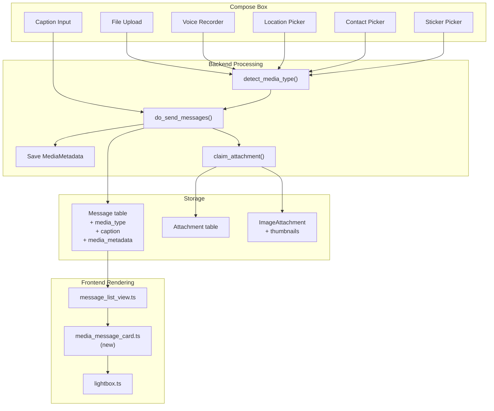
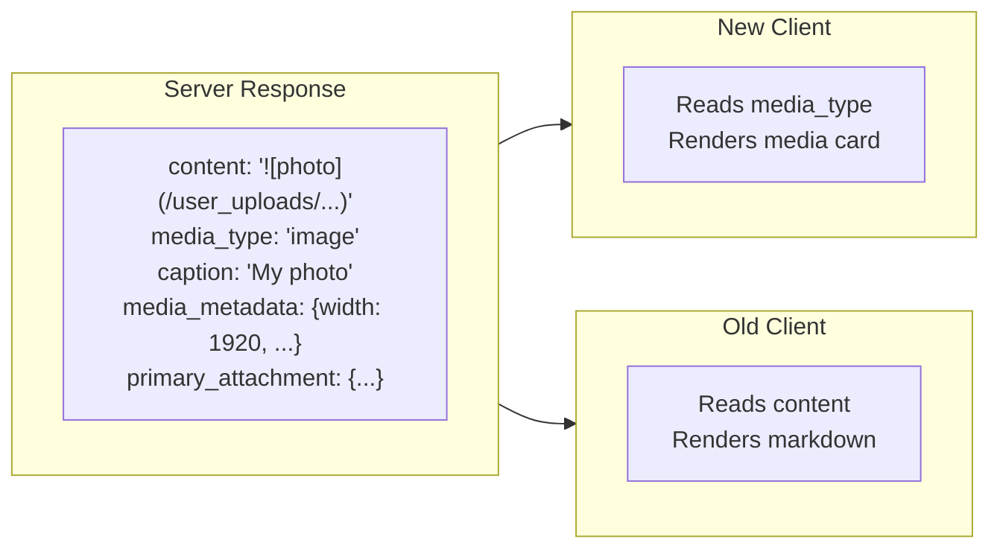

# Rich Media Message Types for Zulip

## Architecture Overview




## Phase 1: Database & Model Changes

### 1.1 Extend MessageType enum

**File:** [zerver/models/messages.py](zerver/models/messages.py) (line 40)

Add new types to the existing `MessageType` `IntegerChoices`:

```python
class MessageType(models.IntegerChoices):
    NORMAL = 1
    RESOLVE_TOPIC_NOTIFICATION = 2
    IMAGE = 3
    VIDEO = 4
    AUDIO = 5
    DOCUMENT = 6
    LOCATION = 7
    CONTACT = 8
    STICKER = 9
    VOICE_MESSAGE = 10
```

**AUDIO vs VOICE_MESSAGE distinction:**

- `AUDIO` (5) — uploaded audio files (music, podcasts, etc.) rendered as a standard audio player with filename, duration, and download button
- `VOICE_MESSAGE` (10) — recorded voice notes captured in-app via the microphone button, rendered with a compact waveform visualization, play/pause, duration, and no download button (mirrors chat-app voice note UX)

### 1.2 Add new fields to AbstractMessage

**File:** [zerver/models/messages.py](zerver/models/messages.py) (after line 120)

```python
# Caption for media messages (separate from content for structured access)
caption = models.TextField(null=True, blank=True)

# Primary attachment FK for quick access (avoids M2M lookup)
primary_attachment = models.ForeignKey(
    'Attachment', on_delete=models.SET_NULL,
    null=True, blank=True,
    related_name='primary_messages'
)

# Structured media metadata as JSON
# Examples:
#   Image: {"width": 1920, "height": 1080, "mime_type": "image/jpeg"}
#   Video: {"width": 1920, "height": 1080, "duration_secs": 30, "mime_type": "video/mp4"}
#   Audio: {"duration_secs": 120, "mime_type": "audio/mpeg"}
#   Voice: {"duration_secs": 15, "mime_type": "audio/webm", "waveform": [0.1, 0.5, 0.8, ...]}
#   Document: {"mime_type": "application/pdf", "page_count": 5}
#   Location: {"latitude": 40.7128, "longitude": -74.0060, "name": "New York"}
#   Contact: {"name": "John Doe", "phone": "+1234567890", "email": "john@example.com"}
#   Sticker: {"pack_id": "emoji_v1", "sticker_id": "thumbs_up"}
media_metadata = models.JSONField(null=True, blank=True)
```

### 1.3 Create migration

**New file:** `zerver/migrations/10009_add_rich_media_message_types.py`

- Add `IMAGE=3` through `VOICE_MESSAGE=10` to `MessageType` choices
- Add `caption`, `primary_attachment`, `media_metadata` fields
- **No backfill** in this migration (existing messages stay as `NORMAL`)
- Add DB indexes on `type` for filtering by media type

## Phase 2: Backend API Changes

### 2.1 Update message send API

**File:** [zerver/views/message_send.py](zerver/views/message_send.py) (line 131)

Add new optional parameters to `send_message_backend()`:

- `media_type` (optional string): `"image"`, `"video"`, `"audio"`, `"voice_message"`, `"document"`, `"location"`, `"contact"`, `"sticker"`
- `caption` (optional string): Caption for media messages
- `media_metadata` (optional JSON): Structured metadata for the media
- `primary_attachment_path_id` (optional string): Path ID of the primary uploaded file

### 2.2 Update message send action

**File:** [zerver/actions/message_send.py](zerver/actions/message_send.py)

In `check_message()` (line 1800):

- Accept `media_type` parameter
- Map string media type to `MessageType` enum value
- Validate media_metadata schema based on type
- Auto-detect type from attachment content_type if `media_type` not provided but attachment exists

In `do_send_messages()` (line 864):

- Save `caption`, `primary_attachment`, `media_metadata` fields
- If `media_type` is set but `content` is empty, generate backward-compatible markdown content from the attachment (e.g., `` for images)

### 2.3 Auto-detection helper

**New file:** `zerver/lib/media_type_detection.py`

```python
def detect_media_type(content_type: str) -> int | None:
    """Map MIME content_type to MessageType enum value."""
    IMAGE_TYPES = {"image/jpeg", "image/png", "image/gif", "image/webp", ...}
    VIDEO_TYPES = {"video/mp4", "video/webm"}
    AUDIO_TYPES = {"audio/mpeg", "audio/wav", "audio/webm", ...}
    # Returns MessageType.IMAGE, VIDEO, AUDIO, or DOCUMENT
```

### 2.4 Update message serialization

**File:** [zerver/lib/message_cache.py](zerver/lib/message_cache.py)

In `messages_to_encoded_cache()` (around line 342) add to the query fields list:

- `"type"`, `"caption"`, `"media_metadata"`, `"primary_attachment_id"`

In `finalize_payload()` (line 192):

- Add `media_type` string field (mapped from integer type)
- Add `caption` field
- Add `media_metadata` field
- Add `primary_attachment` object with `{id, name, path_id, size, content_type}` if present
- Keep existing `content` and `content_type` fields unchanged (backward compat)

### 2.5 Update OpenAPI specification

**File:** [zerver/openapi/zulip.yaml](zerver/openapi/zulip.yaml)

- Add new parameters to POST `/api/v1/messages`
- Add new fields to message object schema in responses
- Document the `media_type` enum values

### 2.6 Mobile REST API changes

All changes are additive to existing endpoints — no breaking changes. Mobile clients already use these endpoints and will receive the new fields automatically.

#### Sending media messages: `POST /api/v1/messages`

New optional parameters (alongside existing `type`, `to`, `content`, `topic`):


| Parameter                    | Type                   | Description                                                                                                      |
| ---------------------------- | ---------------------- | ---------------------------------------------------------------------------------------------------------------- |
| `media_type`                 | string (optional)      | One of: `"image"`, `"video"`, `"audio"`, `"voice_message"`, `"document"`, `"location"`, `"contact"`, `"sticker"` |
| `caption`                    | string (optional)      | Caption text for media messages                                                                                  |
| `media_metadata`             | JSON object (optional) | Structured metadata (schema varies by media_type)                                                                |
| `primary_attachment_path_id` | string (optional)      | Path ID from `/api/v1/user_uploads` or TUS upload                                                                |


**Mobile send flow for a media message:**

```
1. Upload file:       POST /api/v1/user_uploads  (or TUS /api/v1/tus)
                      → returns {url: "/user_uploads/2/ab/cdef/photo.jpg"}
2. Send message:      POST /api/v1/messages
                      {
                        type: "channel",
                        to: "general",
                        topic: "photos",
                        content: "",           // can be empty for media messages
                        media_type: "image",
                        caption: "Sunset photo",
                        primary_attachment_path_id: "2/ab/cdef/photo.jpg",
                        media_metadata: {
                          "width": 1920, "height": 1080, "mime_type": "image/jpeg"
                        }
                      }
                      → returns {id: 42}
```

For **voice messages**, the mobile client records audio natively, uploads the file, and sends:

```json
{
  "media_type": "voice_message",
  "content": "",
  "primary_attachment_path_id": "2/ab/xyz/voice.webm",
  "media_metadata": {
    "duration_secs": 15,
    "mime_type": "audio/webm",
    "waveform": [0.1, 0.3, 0.7, 0.5, 0.2]
  }
}
```

For **location messages** (no file upload needed):

```json
{
  "media_type": "location",
  "content": "",
  "media_metadata": {
    "latitude": 40.7128,
    "longitude": -74.0060,
    "name": "New York City",
    "address": "Manhattan, NY"
  }
}
```

For **contact messages** (no file upload needed):

```json
{
  "media_type": "contact",
  "content": "",
  "media_metadata": {
    "name": "Jane Doe",
    "phone": "+1234567890",
    "email": "jane@example.com"
  }
}
```

#### Receiving media messages: `GET /api/v1/messages` and `GET /api/v1/events`

New fields in the message object returned by both endpoints:

```json
{
  "id": 42,
  "type": "stream",
  "content": "",
  "content_type": "text/html",
  "sender_id": 10,

  "media_type": "image",
  "caption": "Sunset photo",
  "media_metadata": {
    "width": 1920,
    "height": 1080,
    "mime_type": "image/jpeg"
  },
  "primary_attachment": {
    "id": 101,
    "name": "photo.jpg",
    "path_id": "2/ab/cdef/photo.jpg",
    "size": 2048576,
    "content_type": "image/jpeg"
  }
}
```

- `media_type`: `null` for normal text messages, string for media messages
- `caption`: `null` if no caption
- `media_metadata`: `null` for text messages, JSON object for media messages
- `primary_attachment`: `null` for text messages, attachment object for file-based media
- `content`: **always populated** with backward-compatible markdown (old clients still render correctly)

#### Event queue: `POST /api/v1/register`

New client capability to declare support:

```json
{
  "client_capabilities": {
    "rich_media_message_types": true
  }
}
```

When `rich_media_message_types: true`:

- Message events include `media_type`, `caption`, `media_metadata`, `primary_attachment` fields

When `rich_media_message_types: false` (or not set — old clients):

- Message events are unchanged — `content` still contains the full markdown representation
- New fields are omitted to save bandwidth

#### File access (unchanged)

Existing endpoints work as-is for media messages:

- `GET /user_uploads/{realm_id}/{filename}` — access uploaded files
- `GET /user_uploads/{realm_id}/{filename}?thumbnail=...` — access thumbnails

#### Mobile client guide update

**File:** [lms_integration/docs/MOBILE_CLIENT_GUIDE.md](lms_integration/docs/MOBILE_CLIENT_GUIDE.md)

Add new section: "Sending and receiving rich media messages" covering:

- How to upload then send media messages
- How to handle each `media_type` in the mobile UI
- Voice recording and upload flow
- Location message integration with native GPS APIs
- Contact message integration with native contacts API

#### Mobile API endpoint list update

**File:** [dev-docs/MOBILE_API_ENDPOINTS_LIST.md](dev-docs/MOBILE_API_ENDPOINTS_LIST.md)

Add documentation for the new parameters on POST `/api/v1/messages` and the new response fields.

## Phase 3: Frontend Changes

### 3.1 Update TypeScript types

**File:** [web/src/server_message.ts](web/src/server_message.ts)

Add to `server_message_schema`:

```typescript
media_type: z.optional(z.enum([
    "text", "image", "video", "audio", "voice_message",
    "document", "location", "contact", "sticker"
])),
caption: z.optional(z.nullable(z.string())),
media_metadata: z.optional(z.nullable(z.record(z.unknown()))),
primary_attachment: z.optional(z.nullable(z.object({
    id: z.number(),
    name: z.string(),
    path_id: z.string(),
    size: z.number(),
    content_type: z.nullable(z.string()),
}))),
```

**File:** [web/src/message_store.ts](web/src/message_store.ts) — mirror types in `Message` type.

### 3.2 Create media message card component

**New file:** `web/src/media_message_card.ts`

Renders dedicated cards for each media type:

- `renderMediaCard(message)` — dispatches to type-specific renderers
- `renderImageCard()` — large image preview with caption below
- `renderVideoCard()` — video thumbnail with play button overlay, caption below
- `renderAudioCard()` — standard audio player with filename, duration, download button, caption below
- `renderVoiceMessageCard()` — compact waveform visualization with play/pause, duration counter, sender avatar (distinct from audio card)
- `renderDocumentCard()` — file icon + name + size + download button, caption below
- `renderLocationCard()` — map preview (static image from OpenStreetMap or similar)
- `renderContactCard()` — contact name, phone, email in a vCard-style card
- `renderStickerCard()` — large centered sticker image

**New file:** `web/templates/media_message_card.hbs` — Handlebars template

### 3.3 Update message rendering

**File:** [web/src/message_list_view.ts](web/src/message_list_view.ts)

In `_post_process_single_row()` (around line 1068):

- Check `message.media_type` before broadcast check
- If media type exists and is not `"text"`, render using `media_message_card.renderMediaCard()`
- Otherwise fall through to existing markdown rendering

**File:** [web/templates/message_body.hbs](web/templates/message_body.hbs)

Add conditional block before the standard `message_content` div:

```handlebars
{{#if msg/media_type}}
    <div class="message_content media-message-content" data-media-type="{{msg/media_type}}">
        {{!-- Filled by media_message_card.ts --}}
    </div>
{{else}}
    {{!-- Existing rendered_markdown content --}}
{{/if}}
```

### 3.4 Add styles

**New file:** `web/styles/media_message_card.css`

- `.media-message-content` — container
- `.media-image-card` — image card with rounded corners, max-width constraints
- `.media-video-card` — video card with play button overlay
- `.media-audio-card` — audio player card
- `.media-document-card` — document file card with icon
- `.media-location-card` — map preview card
- `.media-contact-card` — contact vCard card
- `.media-sticker-card` — centered sticker display
- `.media-caption` — caption text below media

### 3.5 Update compose box

**File:** [web/src/compose.js](web/src/compose.js) and [web/src/upload.ts](web/src/upload.ts)

- After file upload completes, detect media type from content_type
- Set `media_type` on the message request object
- Allow caption input (reuse the existing textarea — the text typed is the caption)
- Send `media_type`, `caption`, and `primary_attachment_path_id` with the API request

### 3.6 Voice recording UI

**New file:** `web/src/voice_recorder.ts`

Voice recording component for the compose box:

- **Microphone button** in compose toolbar (next to emoji/upload buttons)
- **Recording states:** idle, recording, recorded (ready to send)
- **Recording UI:**
  - Replaces compose textarea with a recording panel while active
  - Shows recording duration timer (elapsed time)
  - Waveform visualization during recording (using Web Audio API `AnalyserNode`)
  - Cancel button (discard recording) and Stop button (finish recording)
- **After recording:**
  - Shows playback preview with waveform, play/pause, duration
  - Send button uploads the audio blob and sends as `media_type: "voice_message"`
  - Delete button discards and returns to normal compose
- **Technical implementation:**
  - Uses `navigator.mediaDevices.getUserMedia({audio: true})` for mic access
  - `MediaRecorder` API with `audio/webm;codecs=opus` format (broad browser support)
  - Generates waveform data (array of amplitude samples) from `AnalyserNode`, stored in `media_metadata.waveform`
  - Uploads recorded blob via the existing `/api/v1/user_uploads` endpoint
  - Permission prompt handled gracefully with error message if denied

**New file:** `web/styles/voice_recorder.css`

- `.voice-recorder-panel` — recording panel container
- `.voice-recorder-waveform` — canvas/SVG waveform display
- `.voice-recorder-timer` — duration counter
- `.voice-recorder-controls` — record/stop/cancel/send buttons

### 3.7 Update local echo

**File:** [web/src/echo.ts](web/src/echo.ts)

- In `try_deliver_locally()`, handle media message types
- Show appropriate placeholder (image thumbnail, file icon, etc.) during local echo

## Phase 4: Additional Features

### 4.1 Location messages

**New file:** `web/src/location_picker.ts`

- Simple map picker using Leaflet.js or static coordinates input
- Sends `media_type: "location"` with `media_metadata: {latitude, longitude, name}`

### 4.2 Contact messages

**New file:** `web/src/contact_picker.ts`

- Form to input contact name, phone, email
- Sends `media_type: "contact"` with `media_metadata: {name, phone, email}`

### 4.3 Sticker messages

- Define sticker packs (could start with emoji-based stickers)
- `media_type: "sticker"` with `media_metadata: {pack_id, sticker_id}`
- Render as large centered image

## Phase 5: Testing

### 5.1 Backend tests

**New file:** `zerver/tests/test_media_message_types.py`

Test cases:

- Sending each media type via API (image, video, audio, voice_message, document, location, contact, sticker)
- Auto-detection of media type from attachment content_type
- Backward compatibility: `content` field still populated
- Caption handling
- Media metadata validation per type (including voice_message waveform data)
- Permission checks (same as regular messages)
- Message editing with media types
- Message fetch returns media fields
- Voice message metadata schema validation

### 5.2 Frontend tests

**New file:** `web/tests/media_message_card.test.js`

Test cases:

- Rendering each card type (including voice_message waveform)
- Caption display
- Lightbox integration for images/videos
- Audio player controls
- Voice message waveform rendering and playback
- Document download link
- Voice recorder UI states (idle, recording, recorded)

### 5.3 API tests

- OpenAPI validation for new parameters
- Ensure old clients without `media_type` still work

## Phase 6: Documentation

### 6.1 Subsystem documentation

**New file:** `docs/subsystems/rich-media-message-types.md`

Sections:

- Overview: what rich media message types are and why they exist
- Architecture: database schema, API flow, rendering pipeline
- Message types reference: each type with its metadata schema (including AUDIO vs VOICE_MESSAGE distinction)
- Voice recording: how voice messages are captured, encoded, and stored
- Backward compatibility: how existing messages and old clients are handled
- Auto-detection: how media types are inferred from attachments
- Frontend rendering: how each type is displayed
- Testing: how to test media message types

### 6.2 API documentation

**Update:** [zerver/openapi/zulip.yaml](zerver/openapi/zulip.yaml)

- Document new `media_type`, `caption`, `media_metadata`, `primary_attachment_path_id` parameters on POST `/messages`
- Document new fields in message response objects
- Add examples for each media type (including voice_message)

### 6.3 Developer documentation

**New file:** `docs/development/rich-media-message-types.md`

- How to add a new media type (extending the enum, adding a renderer, etc.)
- Design decisions and trade-offs
- Voice recording implementation details (MediaRecorder API, waveform generation)
- Migration guide for existing bots/integrations

### 6.4 Help center

**Update:** [help/share-and-upload-files.md](help/share-and-upload-files.md)

- Document the enhanced media cards for users
- Screenshots of each media type rendering

## Backward Compatibility Strategy




- The `content` field always contains backward-compatible markdown
- New fields (`media_type`, `caption`, `media_metadata`, `primary_attachment`) are additive
- Old clients ignore unknown fields and render markdown as before
- New clients check `media_type` first; if present, render the media card; otherwise fall back to markdown

