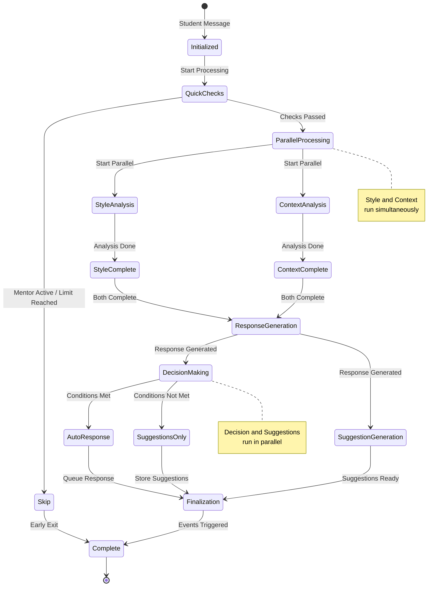
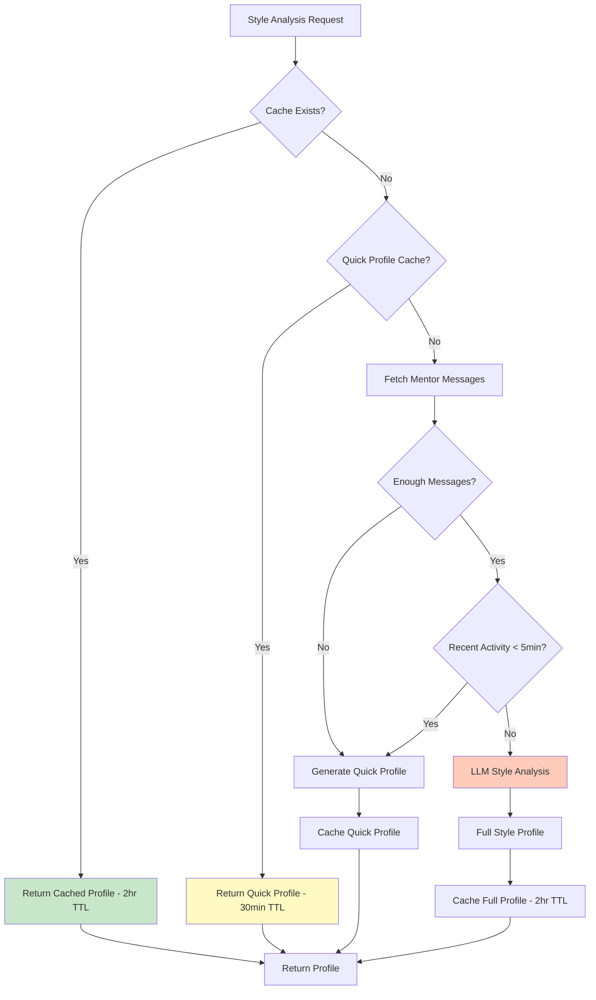
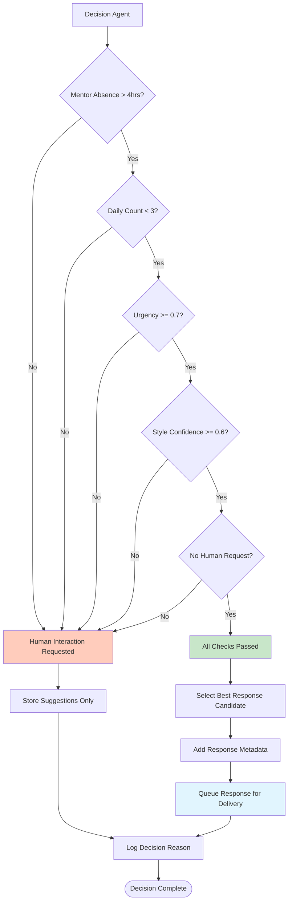
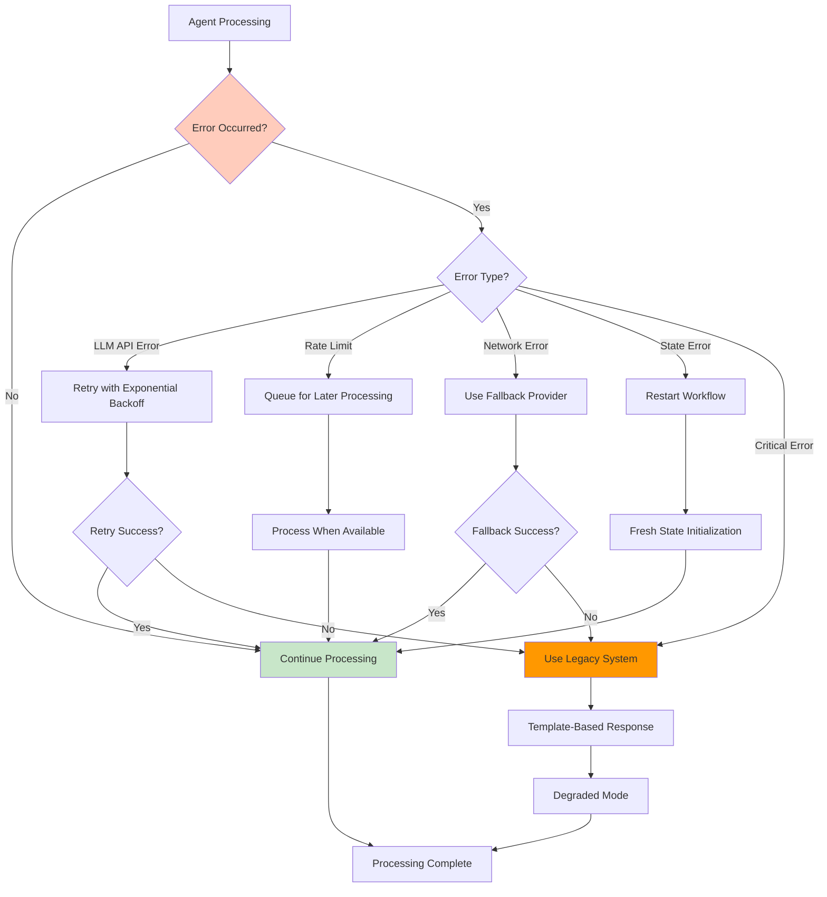
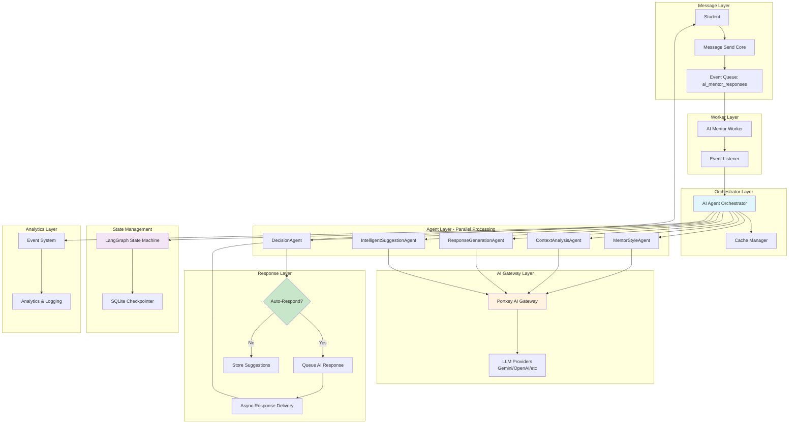

# AI Agent Core - Complete Flow Diagram

## Main Processing Flow

```mermaid
flowchart TD
    Start([Student Sends Message to Mentor]) --> Validate{Is Student→Mentor DM?}
    Validate -->|No| NormalFlow[Normal Message Processing]
    Validate -->|Yes| QueueEvent[Queue AI Agent Conversation Event]
    
    QueueEvent --> Worker[AI Mentor Worker]
    Worker --> EventListener[Event Listener: handle_ai_agent_conversation]
    EventListener --> Orchestrator[AI Agent Orchestrator]
    
    Orchestrator --> QuickChecks[Quick Pre-Checks]
    QuickChecks --> Check1{Mentor Recently Active?}
    Check1 -->|Yes| Skip[Skip Processing - Return Early]
    Check1 -->|No| Check2{Daily Limit Reached?}
    Check2 -->|Yes| Skip
    Check2 -->|No| Check3{Human Request?}
    Check3 -->|Yes| Skip
    Check3 -->|No| InitState[Initialize Agent State]
    
    InitState --> ParallelStart[Start Parallel Processing]
    
    ParallelStart --> StyleAgent[MentorStyleAgent]
    ParallelStart --> ContextAgent[ContextAnalysisAgent]
    
    StyleAgent --> StyleCache{Cache Hit?}
    StyleCache -->|Yes| StyleCached[Return Cached Style Profile]
    StyleCache -->|No| StyleFetch[Fetch Mentor Messages]
    StyleFetch --> StyleAI{Enough Messages?}
    StyleAI -->|No| StyleQuick[Quick Profile Analysis]
    StyleAI -->|Yes| StyleLLM[LLM Style Analysis via Portkey]
    StyleLLM --> StyleResult[Style Profile Result]
    StyleQuick --> StyleResult
    StyleResult --> StyleCacheStore[Cache Style Profile - 2 hours]
    StyleCached --> StyleComplete[Style Analysis Complete]
    StyleCacheStore --> StyleComplete
    
    ContextAgent --> ContextQuick[Quick Keyword Urgency Check]
    ContextQuick --> UrgencyCheck{Urgency < 0.3?}
    UrgencyCheck -->|Yes| ContextSkip[Skip AI - Use Quick Assessment]
    UrgencyCheck -->|No| ContextFetch[Fetch Conversation History]
    ContextFetch --> ContextLLM[LLM Context Analysis via Portkey]
    ContextLLM --> ContextResult[Context Analysis Result]
    ContextSkip --> ContextResult
    ContextResult --> ContextComplete[Context Analysis Complete]
    
    StyleComplete --> ResponseGen[Response Generation Agent]
    ContextComplete --> ResponseGen
    
    ResponseGen --> ResponseTone{Determine Tone}
    ResponseTone -->|High Urgency| SupportiveTone[Supportive Response]
    ResponseTone -->|Has Question| InformativeTone[Informative Response]
    ResponseTone -->|Default| EncouragingTone[Encouraging Response]
    
    SupportiveTone --> ResponseLLM[LLM Response Generation via Portkey]
    InformativeTone --> ResponseLLM
    EncouragingTone --> ResponseLLM
    
    ResponseLLM --> ResponseQuality[Quality Assessment]
    ResponseQuality --> ResponseComplete[Response Candidate Generated]
    
    ResponseComplete --> ParallelDecision[Parallel: Decision + Suggestions]
    
    ParallelDecision --> DecisionAgent[Decision Agent]
    ParallelDecision --> SuggestionAgent[Intelligent Suggestion Agent]
    
    DecisionAgent --> DecisionFactors[Evaluate Decision Factors]
    DecisionFactors --> Factor1{Mentor Absence > 4hrs?}
    Factor1 -->|No| DecisionNo[Should Not Auto-Respond]
    Factor1 -->|Yes| Factor2{Daily Count < Limit?}
    Factor2 -->|No| DecisionNo
    Factor2 -->|Yes| Factor3{Urgency >= Threshold?}
    Factor3 -->|No| DecisionNo
    Factor3 -->|Yes| Factor4{Style Confidence >= 0.6?}
    Factor4 -->|No| DecisionNo
    Factor4 -->|Yes| DecisionYes[Should Auto-Respond]
    
    SuggestionAgent --> SuggestionUrgency{Urgency < 0.5?}
    SuggestionUrgency -->|Yes| RuleBased[Rule-Based Suggestions]
    SuggestionUrgency -->|No| SuggestionLLM[LLM Suggestions via Portkey]
    SuggestionLLM --> SuggestionResult[Enhanced Suggestions]
    RuleBased --> SuggestionResult
    
    DecisionYes --> SelectResponse[Select Best Response Candidate]
    DecisionNo --> StoreOnly[Store Suggestions Only]
    
    SelectResponse --> Finalize[Finalization Node]
    StoreOnly --> Finalize
    
    Finalize --> TriggerEvents[Trigger Success Events]
    TriggerEvents --> LogInteraction[Log Interaction for Analytics]
    
    SelectResponse --> QueueResponse[Queue AI Response for Delivery]
    QueueResponse --> SendResponse[Send Async AI Response]
    SendResponse --> TagMessage[Tag Message as AI-Generated]
    TagMessage --> NotifyMentor[Notify Mentor of AI Response]
    
    StoreOnly --> NotifySuggestions[Notify Mentor with Suggestions]
    
    NotifyMentor --> End([Processing Complete])
    NotifySuggestions --> End
    Skip --> End
    NormalFlow --> End
    
    style Orchestrator fill:#e1f5fe
    style ParallelStart fill:#fff3e0
    style DecisionYes fill:#c8e6c9
    style DecisionNo fill:#ffccbc
    style Portkey fill:#f3e5f5
```

## Parallel Processing Detail

```mermaid
flowchart LR
    Start[Initial State] --> ThreadPool[ThreadPoolExecutor]
    
    ThreadPool --> Task1[Style Analysis Task]
    ThreadPool --> Task2[Context Analysis Task]
    
    Task1 --> Portkey1[Portkey AI Gateway]
    Task2 --> Portkey2[Portkey AI Gateway]
    
    Portkey1 --> Result1[Style Profile]
    Portkey2 --> Result2[Context Analysis]
    
    Result1 --> Merge[Merge Results]
    Result2 --> Merge
    
    Merge --> ResponseGen[Response Generation]
    ResponseGen --> DecisionPar[Parallel: Decision + Suggestions]
    
    DecisionPar --> DecisionTask[Decision Task]
    DecisionPar --> SuggestionTask[Suggestion Task]
    
    DecisionTask --> Final[Final State]
    SuggestionTask --> Final
    
    style ThreadPool fill:#fff3e0
    style Merge fill:#e1f5fe
    style Final fill:#c8e6c9
```

## Agent Workflow State Machine

## Cache Flow

## Decision Flow

## Error Handling Flow

## Complete System Architecture

