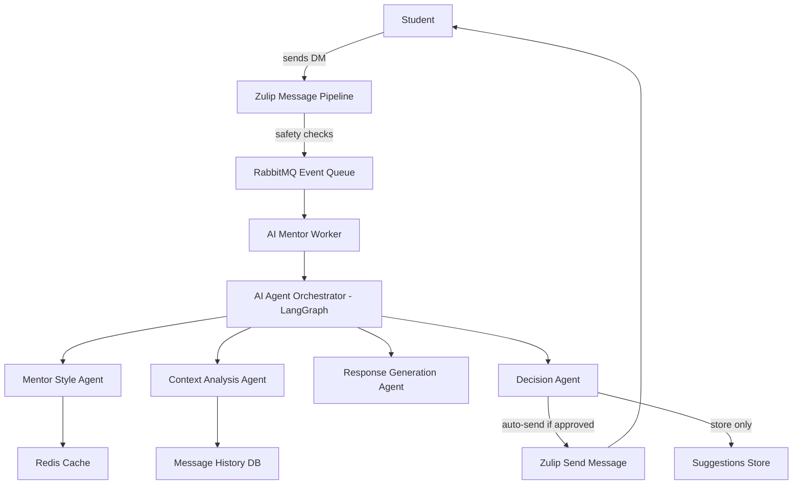
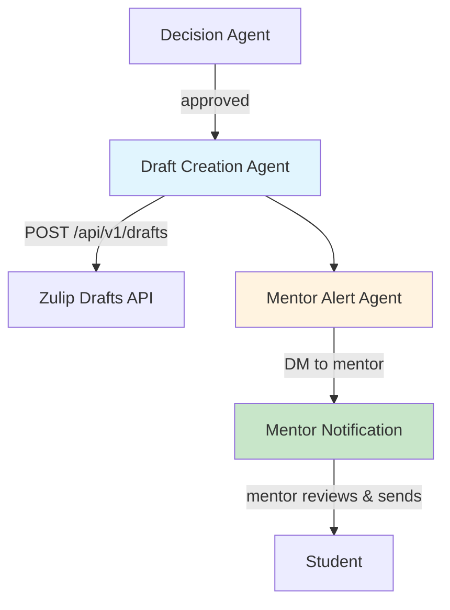
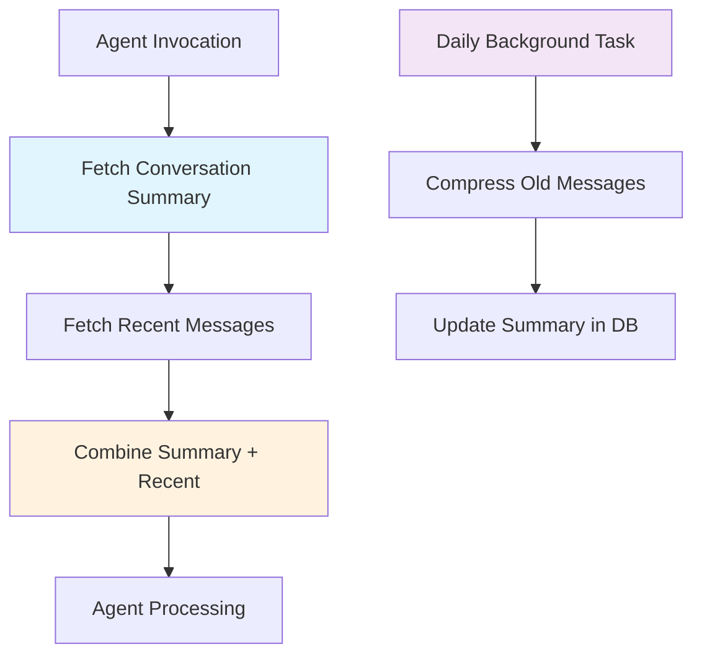
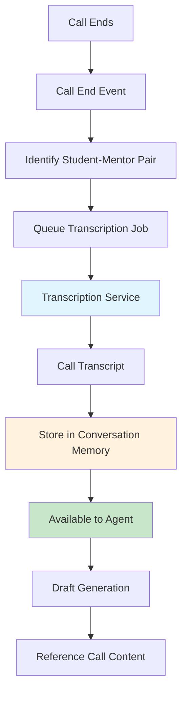
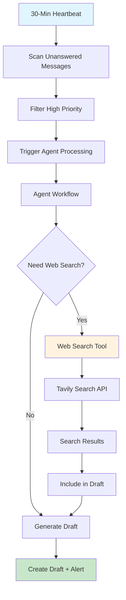

# AI Agent Design Document

## Executive Summary

The Zulip AI Mentor Agent is an intelligent assistant system that enhances communication between students and mentors in educational environments. The system analyzes student messages, understands mentor communication styles, and provides intelligent assistance while maintaining complete transparency and mentor oversight.

### Problem Statement

Students often need quick responses from mentors, but mentors may be unavailable or overwhelmed with multiple student inquiries. The AI Agent bridges this gap by providing intelligent, context-aware assistance that matches each mentor's unique communication style.

### Core Principles

- **Non-Intrusive**: AI processing never blocks or delays message delivery
- **Transparent**: Mentors always know when AI assistance is used
- **Safe**: Multiple validation layers ensure appropriate use
- **Asynchronous**: All AI processing happens in background queues

---

## Current Architecture

### How It Works

The AI Agent operates as an event-driven system integrated into Zulip's messaging infrastructure. When a student sends a direct message to their mentor:

1. The message is delivered immediately (no delay)
2. An AI processing event is queued in the background
3. The system analyzes the message to determine if an AI-generated response would be helpful
4. If appropriate, an AI response is automatically sent on behalf of the mentor

### System Architecture

### Key Components

#### Message Pipeline

When a student sends a message to their mentor, the system performs safety checks:

- Verifies the sender is a student and recipient is a mentor
- Ensures both users are in the same organization
- Validates message content

If all checks pass, the message is delivered immediately, and an AI processing event is queued for background processing. This ensures **zero impact** on message delivery speed.

#### Event Queue

The event queue decouples AI processing from message delivery. Events are processed asynchronously by dedicated worker processes, allowing the system to handle high message volumes without affecting core messaging performance.

#### AI Mentor Worker

A dedicated background worker process that:

- Picks up AI processing events from the queue
- Dispatches events to appropriate handlers
- Manages error isolation (failures never affect message delivery)
- Runs continuously in the background

#### AI Agent Orchestrator

The central coordinator that orchestrates five specialized agents:

**Mentor Style Agent**: Analyzes the mentor's past messages to understand their communication patterns, tone, and style. Results are cached for 2 hours.

**Context Analysis Agent**: Assesses the urgency and sentiment of the student's message. Uses smart filtering to skip unnecessary processing for low-urgency messages.

**Response Generation Agent**: Creates a high-quality response that matches the mentor's style and addresses the student's needs.

**Decision Agent**: Evaluates multiple criteria to determine if an auto-response is appropriate:

- Mentor has been absent for at least 4 hours
- Daily response limit hasn't been exceeded (default: 3 responses/day)
- Message urgency exceeds threshold
- Style confidence is sufficient

**Intelligent Suggestion Agent**: Generates contextual suggestions for mentors even when auto-response isn't appropriate.

#### AI Gateway

Uses Portkey AI Gateway with Google Gemini 2.0 Flash Lite (default) to provide:

- Enterprise-grade AI access
- Built-in retry logic and error handling
- Usage tracking and cost optimization

#### State Management & Caching

- **State Persistence**: SQLite database stores workflow state for recovery
- **Caching**: Redis cache stores mentor profiles (2 hours), response counts (5 minutes), and other frequently accessed data
- **Performance**: Aggressive caching ensures sub-3-second processing times

### Current Behavior

When the Decision Agent determines that an auto-response is appropriate, the system **automatically sends** the AI-generated message as if it came from the mentor. The mentor receives a notification about the AI response, but the message is already delivered to the student.

**Current Flow**:

1. Student sends message → Message delivered immediately
2. AI processing begins asynchronously
3. If approved → AI response sent automatically
4. Mentor notified of the AI response

---

## Proposed Enhancements

This section outlines four major enhancements that will transform the AI Agent into a more powerful, mentor-controlled, and context-aware assistant.

---

### Enhancement 1: Draft Mode + Mentor Alert

**What Changes**: Instead of automatically sending messages, the agent will create **message drafts** and alert mentors to review them before sending.

#### Why This Matters

- **Mentor Control**: Mentors maintain full control over what messages are sent
- **Quality Assurance**: Mentors can review and edit AI suggestions before sending
- **Transparency**: Students know responses are mentor-reviewed
- **Learning**: Mentors can see AI suggestions and learn from them

#### How It Works

**New Components**:

1. **Draft Creation Agent**: Creates a Zulip message draft
  - Draft is saved to the mentor's draft list
  - Draft includes the AI-generated content
  - Draft is pre-filled with recipient (student) and content
2. **Mentor Alert Agent**: Sends a private notification to the mentor
  - Notification includes preview of the draft
  - Direct link to review/edit the draft
  - Context about why the draft was created

**New Flow**:

**Technical Implementation**:

- Creates drafts using Zulip's draft API
- Sends alert message to mentor with draft preview
- Decision Agent creates drafts instead of sending messages directly

---

### Enhancement 2: Long Context Awareness

**What Changes**: The agent will remember conversations beyond the current session, enabling awareness of prior weeks/months of interaction.

#### Why This Matters

- **Learning Trajectory**: Understand student progress over time
- **Personalization**: Remember past conversations and student needs
- **Context Continuity**: Reference previous discussions naturally
- **Relationship Building**: Maintain awareness of mentor-student relationship history

#### How It Works

**New Components**:

1. **Conversation Memory Storage**: Stores compressed summaries of past conversations
  - One summary per mentor-student pair
  - Summaries updated periodically (daily)
  - Maintains rolling summaries (e.g., last 3 months)
2. **Memory Compression**: Background task that compresses old messages into summaries
  - Runs daily automatically
  - Uses AI to create concise summaries
  - Preserves key topics, student progress, and important context
3. **Context Retrieval**: Agent combines summary + recent messages
  - Fetches persistent summary on each invocation
  - Combines with last 10 recent messages
  - Provides long-term context without overwhelming limits

**Architecture**:

---

### Enhancement 3: Call Listening (Voice/Video Transcription)

**What Changes**: The agent will transcribe and analyze voice/video calls between students and mentors, using this content to inform future responses.

#### Why This Matters

- **Complete Context**: Understand both text and voice conversations
- **Follow-up Assistance**: Reference call content when drafting responses
- **Comprehensive History**: Maintain full conversation record across channels
- **Better Understanding**: Voice conversations often contain nuanced information

#### How It Works

**New Components**:

1. **Call Transcription Service**: Processes call recordings after calls end
  - Automatically detects when student-mentor calls end
  - Uses transcription service (Whisper API, Deepgram, or similar)
  - Extracts transcript with timestamps and speaker labels
2. **Call Event Integration**: Extends Zulip's call system
  - Listens for call end events
  - Identifies student-mentor calls
  - Queues transcription job automatically
3. **Transcript Storage**: Stores transcripts in conversation context
  - Links transcripts to conversation memory
  - Available for agent to reference when drafting responses
  - Respects privacy settings (consent required)

**Architecture**:

**Privacy & Security**:

- Requires explicit consent from both participants
- Recordings automatically deleted after transcription (default: 24 hours)
- Transcripts stored securely and only accessible to mentor

---

### Enhancement 4: OpenClaw-Style Autonomous + Internet Search

**What Changes**: The agent will operate proactively (checking for unanswered messages) and can search the internet for real-time information to provide better answers.

#### Why This Matters

- **Proactive Assistance**: Help students even when mentors are unavailable
- **Real-Time Information**: Access current documentation, tutorials, error solutions
- **Comprehensive Answers**: Combine internal knowledge with web search
- **Autonomous Operation**: Operate 24/7 without constant prompts

#### How It Works

**New Components**:

1. **Heartbeat System**: Background task that runs every 30 minutes
  - Scans for unanswered student messages
  - Proactively drafts responses for high-priority messages
  - Operates autonomously without manual triggers
2. **Web Search Tool**: Internet search capability integrated into the agent
  - Uses Tavily Search API or SerpAPI
  - Agent automatically searches when needed (technical questions, error messages, etc.)
  - Search results included in draft with source citations
3. **Skill Extensibility**: Tool registry for adding new capabilities
  - Plugin architecture for new features
  - Examples: Code execution, LMS data lookup, calendar integration
  - Community-contributed skills

**Architecture**:

**Search Capabilities**:

- Agent automatically searches when it detects:
  - Technical questions → Search documentation
  - Error messages → Search solutions
  - General questions → Search tutorials/examples
- Search results include source URLs for citations
- Rate limiting: Max 5 searches per conversation per day
- Privacy: Only searches for non-sensitive technical queries

**Example Tools**:

- `web_search`: Search the internet
- `code_execution`: Run code snippets (sandboxed)
- `lms_lookup`: Query LMS for student data
- `calendar_check`: Check mentor availability

---

## Security & Privacy

### Data Protection

**Draft Mode Security**

- All drafts stored in Zulip's database (not external services)
- Drafts respect Zulip's access control (mentor can only see their drafts)
- Draft content encrypted at rest (same as messages)

**Long Context Privacy**

- Conversation summaries stored per mentor-student pair
- Summaries exclude sensitive information (passwords, tokens, etc.)
- Access controlled by Zulip's role-based permissions
- Summaries can be deleted on request (GDPR compliance)

**Call Transcription Privacy**

- **Consent Required**: Both participants must consent to transcription
- **Recording Retention**: Recordings deleted after transcription (default: 24 hours)
- **Transcript Storage**: Stored securely, accessible only to mentor and system
- **Opt-Out**: Users can disable call transcription in settings

**Web Search Privacy**

- Only searches for non-sensitive technical queries
- Search queries logged for audit (no student data in queries)
- Search results filtered for inappropriate content
- Rate limiting prevents abuse

### Mentor Control

- **Always in the Loop**: No autonomous message sending (draft mode)
- **Full Control**: Mentors review and edit all AI suggestions
- **Transparency**: Clear indicators when AI assistance is used
- **Opt-Out**: Mentors can disable AI assistance per-student or globally

---

## Summary

### Feature Comparison

| Feature              | Current                    | Proposed                              |
| -------------------- | -------------------------- | ------------------------------------- |
| **Message Delivery** | Auto-sends as mentor       | Drafts + alerts mentor                |
| **Context Window**   | Recent messages + 2h cache | Persistent summaries + rolling memory |
| **Call Awareness**   | None                       | Post-call transcription               |
| **Internet Access**  | None                       | Tavily/SerpAPI web search             |
| **Proactivity**      |                            | 30-min heartbeat scan                 |

### Key Benefits

1. **Draft Mode**: Mentors maintain control, students get faster responses, quality improves through review
2. **Long Context**: Better personalization, continuity across conversations, understanding of student progress
3. **Call Listening**: Complete conversation history, better follow-up responses, comprehensive context
4. **Autonomous + Search**: Proactive assistance, real-time information, extensible capabilities

### Implementation Roadmap

1. **Phase 1**: Draft Mode + Mentor Alert (highest impact, moderate complexity)
2. **Phase 2**: Long Context Awareness (high value, moderate complexity)
3. **Phase 3**: Web Search Integration (high value, low complexity)
4. **Phase 4**: Call Listening (moderate value, high complexity)
5. **Phase 5**: Heartbeat System (moderate value, moderate complexity)

---

## Conclusion

The proposed enhancements transform the AI Agent from a reactive auto-response system into a proactive, context-aware assistant that empowers mentors while maintaining their oversight and control. The draft mode ensures mentors remain in control, while long context awareness, call listening, and web search capabilities enable the agent to provide increasingly sophisticated assistance.

These changes align with OpenClaw's philosophy of autonomous, extensible AI agents while maintaining Zulip's core principles of transparency, security, and user control. The system evolves from a helpful automation tool into a comprehensive AI assistant that enhances rather than replaces human mentorship.