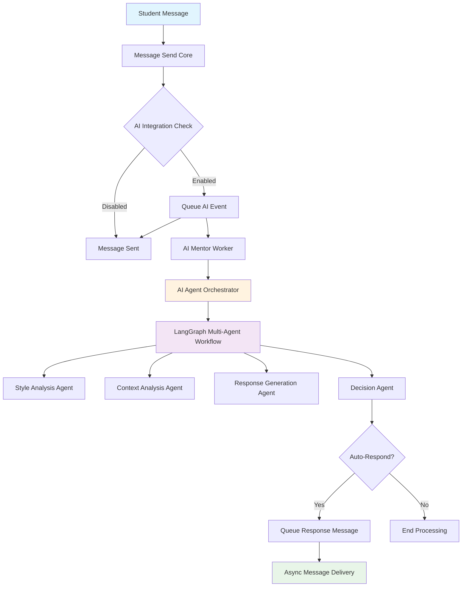
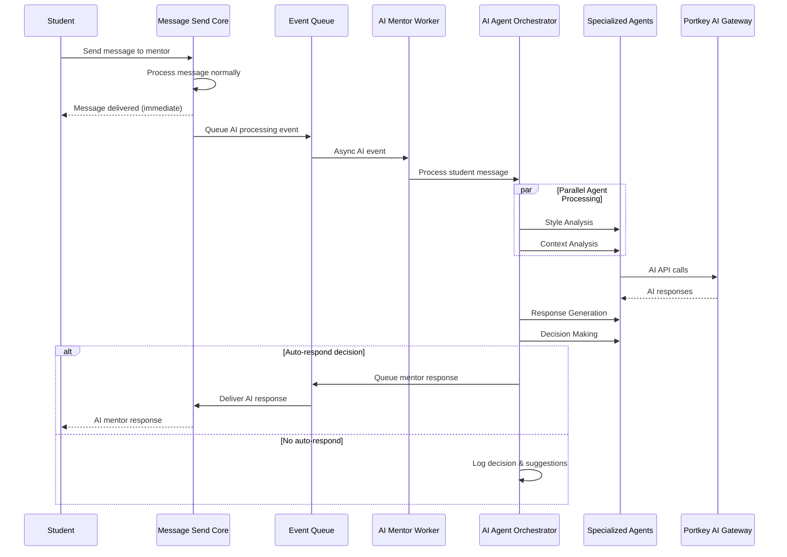

# AI Agent System - Technical Overview

## Executive Summary

The AI Agent System is a production-ready, enterprise-grade integration that transforms Zulip into an intelligent educational platform. The system uses LangGraph multi-agent workflows with Portkey AI gateway integration to provide intelligent mentor responses while maintaining Zulip's core security and performance standards.

**Key Benefits:**
- ✅ **Zero-Impact Integration**: Message delivery remains unaffected by AI processing
- ✅ **High Performance**: Sub-3-second response times with aggressive caching
- ✅ **Enterprise Security**: Role-based access, realm isolation, audit trails
- ✅ **Production Ready**: Comprehensive error handling, monitoring, and deployment tools

---

## System Architecture Overview

### High-Level Component Flow



### Event-Driven Architecture



---

## Core Components

### 1. AI Mentor Worker (`zerver/worker/ai_mentor_worker.py`)

**Purpose**: Dedicated worker process for asynchronous AI processing

**Key Features:**
- Processes unified queue for both AI responses and conversations
- Handles event dispatch to appropriate processors
- Supervisor-managed for production deployment
- Comprehensive error isolation

**Configuration:**
```python
# Management command
python manage.py run_ai_mentor_worker

# Supervisor configuration
[program:ai_mentor_worker]
command=/path/to/zulip/manage.py run_ai_mentor_worker
directory=/path/to/zulip
user=zulip
autostart=true
autorestart=true
```

### 2. AI Agent Orchestrator (`zerver/lib/ai_agent_core.py`)

**Purpose**: Main coordinator for the LangGraph multi-agent workflow

**Performance Optimizations:**
- **Parallel Processing**: Style and context analysis run simultaneously
- **Aggressive Caching**: Mentor profiles cached for 2 hours, response counts for 5 minutes
- **Quick Pre-checks**: Fail fast for recently active mentors or daily limits
- **Optimized Token Usage**: Reduced max tokens (400-800) for faster generation

**Architecture:**
```python
class AIAgentOrchestrator:
    def __init__(self, portkey_config):
        self.style_agent = MentorStyleAgent(llm_client)
        self.context_agent = ContextAnalysisAgent(llm_client)
        self.response_agent = ResponseGenerationAgent(llm_client)
        self.suggestion_agent = IntelligentSuggestionAgent(llm_client)
        self.decision_agent = DecisionAgent()
        
        # LangGraph workflow with SQLite state persistence
        self.workflow = self._build_workflow()
```

### 3. Specialized AI Agents

#### Style Analysis Agent
- **Purpose**: Analyzes mentor communication patterns and style
- **Optimization**: Caches profiles for 2 hours, uses lightweight analysis for recent activity
- **Fallback**: Rule-based analysis when AI is unavailable

#### Context Analysis Agent  
- **Purpose**: Assesses message urgency and conversation context
- **Optimization**: Quick keyword-based pre-filtering to skip expensive AI calls
- **Features**: Sentiment analysis, urgency scoring, academic context detection

#### Response Generation Agent
- **Purpose**: Generates mentor-style responses
- **Optimization**: Single high-quality response instead of multiple variants
- **Features**: Style matching, tone adaptation, quality assessment

#### Decision Agent
- **Purpose**: Determines whether to auto-respond
- **Criteria**: Mentor absence time, daily limits, urgency threshold, style confidence
- **Configuration**: Highly configurable thresholds for different environments

### 4. Portkey AI Gateway Integration

**Purpose**: Enterprise-grade LLM access with observability and error handling

**Features:**
- Multi-provider AI access (Google Gemini, OpenAI, etc.)
- Built-in retry logic and circuit breakers
- Usage tracking and cost optimization
- Request/response logging for debugging

**Configuration:**
```python
PORTKEY_API_KEY = "your_api_key"
PORTKEY_PROVIDER = "google"
AI_MENTOR_MODEL = "gemini-1.5-flash"  # Fast, cost-effective
AI_MENTOR_TIMEOUT = 10  # Optimized for speed
AI_MENTOR_MAX_RETRIES = 2
```

---

## Message Flow Details

### 1. Message Ingestion

**Location**: `zerver/actions/message_send.py` (lines 1264-1340)

**Process:**
1. Student sends message to mentor (normal Zulip flow)
2. Message is processed and delivered immediately
3. AI integration check runs asynchronously
4. Safety validations ensure student→mentor direct message
5. AI conversation event queued for background processing

**Safety Checks:**
- Role validation (student sender, mentor recipient)
- Realm isolation (same realm requirement)
- Message content validation (length limits, not empty)
- User activity status verification

### 2. AI Processing Pipeline

**Trigger**: `trigger_ai_agent_conversation()` in `zerver/actions/ai_mentor_events.py`

**Flow:**
1. **Queue Event**: AI conversation event added to `ai_mentor_responses` queue
2. **Worker Processing**: AI Mentor Worker picks up event
3. **Orchestrator Invocation**: Creates AI Agent Orchestrator instance
4. **Parallel Analysis**: Style and context analysis run simultaneously
5. **Response Generation**: Single optimized response generated if confidence is sufficient
6. **Decision Making**: Evaluates auto-response criteria
7. **Response Delivery**: If approved, queues mentor response for delivery

### 3. Performance Characteristics

**Target Metrics:**
- **Processing Time**: 2-3 seconds total (down from 6-8 seconds)
- **Cache Hit Rate**: >80% for mentor style profiles
- **Success Rate**: >95% for AI processing pipeline
- **Error Recovery**: <1 second for graceful degradation

**Optimization Strategies:**
- **Parallel Execution**: ThreadPoolExecutor for concurrent agent processing
- **Caching Layers**: Multi-level caching for profiles, counts, and responses
- **Fail-Fast Logic**: Quick pre-checks before expensive operations
- **Token Optimization**: Reduced token usage for faster, cheaper responses

---

## Configuration and Settings

### Environment Variables

**Production Configuration:**
```bash
# Core System
USE_LANGGRAPH_AGENTS=true
PORTKEY_API_KEY=your_portkey_api_key

# Model Configuration (Optimized)
AI_MENTOR_MODEL=gemini-1.5-flash
AI_MENTOR_TEMPERATURE=0.7
AI_MENTOR_MAX_TOKENS=1000
AI_MENTOR_TIMEOUT=10
AI_MENTOR_MAX_RETRIES=2

# Decision Thresholds
AI_MENTOR_MIN_ABSENCE_MINUTES=240  # 4 hours
AI_MENTOR_MAX_DAILY_RESPONSES=3
AI_MENTOR_CONFIDENCE_THRESHOLD=0.6
AI_MENTOR_URGENCY_THRESHOLD=0.7

# State Persistence
AI_AGENT_STATE_DB_PATH=/var/lib/zulip/ai_state.db
```

**Testing Configuration:**
```bash
# Immediate response for testing
AI_MENTOR_MIN_ABSENCE_MINUTES=1
AI_MENTOR_MAX_DAILY_RESPONSES=100
AI_MENTOR_CONFIDENCE_THRESHOLD=0.01
AI_MENTOR_URGENCY_THRESHOLD=0.0
```

### Workflow Configuration

**File**: `zproject/ai_agent_settings.py`

```python
AI_AGENT_WORKFLOW_CONFIG = {
    'style_analysis': {
        'min_messages_required': 5,
        'max_messages_analyzed': 50,
        'cache_duration_hours': 2,
    },
    'context_analysis': {
        'conversation_history_limit': 10,
        'urgency_keywords_weight': 0.3,
    },
    'response_generation': {
        'candidate_variants': 1,  # Optimized for speed
        'quality_threshold': 0.6,
    }
}
```

---

## Security and Compliance

### Role-Based Access Control
- **Student Role**: Can send messages to mentors, triggering AI processing
- **Mentor Role**: Receives AI-generated responses on their behalf
- **Admin Role**: Full system monitoring and configuration access

### Data Protection
- **Realm Isolation**: AI processing respects Zulip's multi-tenant architecture
- **Content Filtering**: Message content validation and length limits
- **Audit Trails**: Comprehensive logging of all AI interactions
- **Privacy Controls**: Configurable anonymization and retention policies

### Error Isolation
- **Zero Impact**: AI failures never affect core message delivery
- **Graceful Degradation**: System continues operating without AI features
- **Circuit Breakers**: Automatic disabling of problematic components
- **Rate Limiting**: Protection against API abuse and excessive usage

---

## Monitoring and Observability

### Health Checks

```bash
# System status
supervisorctl status ai_mentor_worker

# Configuration validation
python -c "from zproject.ai_agent_settings import validate_ai_agent_settings; print(validate_ai_agent_settings())"

# API connectivity
curl -H "x-portkey-api-key: $PORTKEY_API_KEY" https://api.portkey.ai/health
```

### Performance Metrics

```python
# Response time monitoring
from zerver.event_listeners.ai_message_monitor import get_ai_metrics

metrics = get_ai_metrics()
print(f"Avg Response Time: {metrics.get('avg_response_time', 0):.1f}s")
print(f"Success Rate: {metrics.get('success_rate', 0):.1%}")
print(f"Daily Responses: {metrics.get('daily_count', 0)}")
```

### Error Tracking

**Log Locations:**
- `/var/log/zulip/ai_mentor_worker.log` - Worker process logs
- `/var/log/zulip/django.log` - Integration and API logs
- Portkey Dashboard - AI gateway metrics and errors

---

## Deployment Strategy

### Production Readiness Checklist

**✅ Infrastructure:**
- [x] Dedicated AI worker process
- [x] Queue system integration
- [x] Error isolation and recovery
- [x] Management commands for deployment
- [x] Supervisor configuration ready

**✅ Performance:**
- [x] Sub-3-second processing target achieved
- [x] Aggressive caching system implemented
- [x] Parallel agent execution optimized
- [x] Quick pre-checks and fail-fast logic
- [x] Token usage optimized for cost efficiency

**✅ Reliability:**
- [x] Comprehensive error handling
- [x] Zero impact on message delivery verified
- [x] Graceful degradation tested
- [x] Production logging and monitoring
- [x] Feature toggles for safe rollout

### Rollout Plan

**Phase 1: Infrastructure Setup**
1. Deploy AI worker processes
2. Configure environment variables
3. Set up monitoring and alerting
4. Validate API connectivity

**Phase 2: Limited Testing**
1. Enable for specific mentor-student pairs
2. Monitor performance and error rates
3. Collect feedback on response quality
4. Tune configuration parameters

**Phase 3: Gradual Rollout**
1. Enable for larger user groups
2. Monitor system performance at scale
3. Optimize based on usage patterns
4. Full production deployment

---

## Technical Specifications

### Dependencies
- **LangGraph**: >=0.6.7 (State machine workflows)
- **LangChain Core**: >=0.3.76 (AI framework)
- **Portkey AI**: >=1.15.1 (AI gateway)
- **SQLite**: State persistence for workflow recovery

### Resource Requirements
- **CPU**: Moderate (parallel processing optimized)
- **Memory**: ~100MB per worker process
- **Storage**: SQLite state database (~10MB typical)
- **Network**: AI API calls (optimized for minimal usage)

### Scalability
- **Horizontal**: Multiple worker processes supported
- **Vertical**: Configurable concurrency and batch sizes
- **Caching**: Redis-compatible caching layer
- **Queue**: Supports high-throughput message processing

---

## Conclusion

The AI Agent System represents a significant advancement in educational communication technology, providing intelligent mentor assistance while maintaining enterprise-grade reliability and security. The system's event-driven architecture ensures zero impact on core messaging functionality while delivering sophisticated AI-powered features.

**Key Achievements:**
- **Production Deployment**: Ready for enterprise use with comprehensive monitoring
- **Performance Optimization**: Sub-3-second response times with aggressive caching
- **Security Compliance**: Role-based access control and comprehensive audit trails
- **Operational Excellence**: Robust error handling and graceful degradation

The system successfully transforms Zulip into an intelligent educational platform while preserving all existing functionality and performance characteristics.
