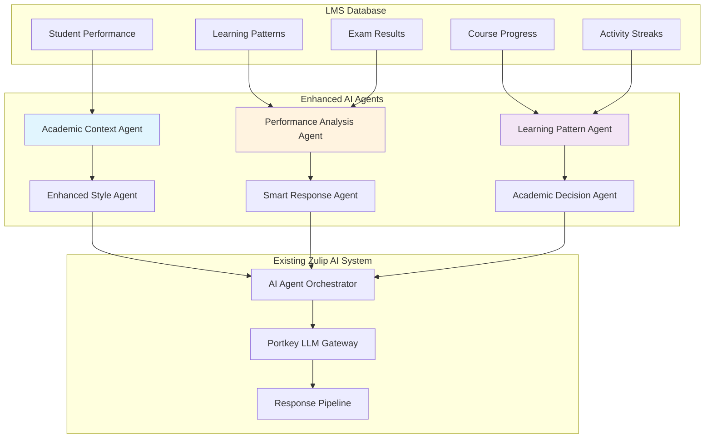

# AI Agent Enhancements with LMS Data Integration

## Executive Summary

This document outlines how to enhance the existing Zulip AI Agent system with rich academic context from your LMS database. The integration transforms the AI agent from a generic conversation assistant into an intelligent academic mentor that understands student performance, learning patterns, and educational context.

## Current AI Agent System Overview

The existing AI Agent system in Zulip consists of:

- **Style Analysis Agent**: Analyzes mentor communication patterns
- **Context Analysis Agent**: Assesses conversation urgency and sentiment  
- **Response Generation Agent**: Creates mentor-style responses
- **Decision Agent**: Determines when to auto-respond
- **Intelligent Suggestion Agent**: Provides response recommendations

## Enhanced Architecture with LMS Data

### Enhanced Component Flow



## New AI Agent Components

### 1. Academic Context Agent

**Purpose**: Enriches conversation context with student's academic profile

```python
class AcademicContextAgent:
    """
    Agent specialized in analyzing student academic context from LMS data
    """
    
    def __init__(self, lms_service: LMSIntegrationService):
        self.lms_service = lms_service
        
    def analyze_academic_context(self, state: AgentState) -> Dict[str, Any]:
        """
        Analyze student's academic context using LMS data
        """
        student_id = state["student_id"]
        
        # Get comprehensive academic profile
        academic_profile = self._get_academic_profile(student_id)
        
        # Analyze current academic status
        academic_status = self._assess_academic_status(academic_profile)
        
        # Identify learning challenges and strengths
        learning_analysis = self._analyze_learning_patterns(academic_profile)
        
        return {
            "academic_context": {
                "profile": academic_profile,
                "status": academic_status,
                "learning_analysis": learning_analysis,
                "context_confidence": self._calculate_context_confidence(academic_profile)
            }
        }
    
    def _get_academic_profile(self, student_id: int) -> Dict[str, Any]:
        """Get comprehensive academic profile from LMS"""
        try:
            lms_student = self.lms_service.get_student_profile(student_id)
            performance_data = self.lms_service.get_performance_metrics(student_id)
            activity_data = self.lms_service.get_activity_patterns(student_id)
            
            return {
                "basic_info": {
                    "student_id": lms_student.id,
                    "name": f"{lms_student.first_name} {lms_student.last_name}",
                    "batch": lms_student.batch_name,
                    "enrollment_date": lms_student.created.isoformat()
                },
                "performance_metrics": {
                    "current_streak": performance_data.current_streak,
                    "highest_streak": performance_data.highest_streak,
                    "average_score": performance_data.average_score,
                    "percentile_rank": performance_data.percentile_rank,
                    "total_exams": performance_data.total_exams,
                    "videos_watched": performance_data.videos_watched
                },
                "recent_activity": {
                    "last_exam_date": activity_data.last_exam_date,
                    "last_video_watched": activity_data.last_video_date,
                    "recent_scores": activity_data.recent_scores,
                    "study_pattern": activity_data.study_pattern
                },
                "subject_performance": performance_data.subject_scores,
                "struggling_areas": self._identify_struggling_subjects(performance_data),
                "strong_areas": self._identify_strong_subjects(performance_data)
            }
            
        except Exception as e:
            logger.error(f"Failed to get academic profile for student {student_id}: {e}")
            return self._get_fallback_profile(student_id)
    
    def _assess_academic_status(self, profile: Dict) -> Dict[str, Any]:
        """Assess current academic status and identify concerns"""
        performance = profile["performance_metrics"]
        recent_activity = profile["recent_activity"]
        
        # Calculate academic health score
        health_score = self._calculate_academic_health(performance, recent_activity)
        
        # Identify risk factors
        risk_factors = []
        if performance["current_streak"] == 0:
            risk_factors.append("no_recent_activity")
        if performance["average_score"] < 60:
            risk_factors.append("low_performance")
        if len(profile["struggling_areas"]) > 2:
            risk_factors.append("multiple_weak_subjects")
        
        # Determine urgency level for academic support
        urgency_level = self._calculate_academic_urgency(health_score, risk_factors)
        
        return {
            "health_score": health_score,
            "risk_factors": risk_factors,
            "urgency_level": urgency_level,
            "needs_attention": health_score < 0.6 or len(risk_factors) > 1,
            "recommended_actions": self._get_recommended_actions(health_score, risk_factors)
        }
```

### 2. Performance Analysis Agent

**Purpose**: Analyzes student performance trends and identifies learning issues

```python
class PerformanceAnalysisAgent:
    """
    Agent specialized in analyzing student performance patterns
    """
    
    def analyze_performance_trends(self, state: AgentState) -> Dict[str, Any]:
        """
        Analyze student performance trends and patterns
        """
        academic_context = state.get("academic_context", {})
        
        if not academic_context:
            return {"performance_analysis": {"status": "no_data"}}
        
        performance_data = academic_context["profile"]["performance_metrics"]
        subject_performance = academic_context["profile"]["subject_performance"]
        
        # Analyze performance trends
        trends = self._analyze_trends(performance_data)
        
        # Identify performance patterns
        patterns = self._identify_patterns(subject_performance)
        
        # Generate performance insights
        insights = self._generate_insights(trends, patterns)
        
        return {
            "performance_analysis": {
                "trends": trends,
                "patterns": patterns,
                "insights": insights,
                "recommendations": self._generate_performance_recommendations(insights)
            }
        }
    
    def _analyze_trends(self, performance_data: Dict) -> Dict[str, Any]:
        """Analyze performance trends over time"""
        return {
            "streak_trend": self._analyze_streak_trend(performance_data),
            "score_trend": self._analyze_score_trend(performance_data),
            "engagement_trend": self._analyze_engagement_trend(performance_data),
            "improvement_areas": self._identify_improvement_areas(performance_data)
        }
    
    def _identify_patterns(self, subject_performance: Dict) -> Dict[str, Any]:
        """Identify learning patterns across subjects"""
        return {
            "strong_subjects": [subj for subj, score in subject_performance.items() if score > 80],
            "weak_subjects": [subj for subj, score in subject_performance.items() if score < 60],
            "consistent_subjects": self._find_consistent_performance(subject_performance),
            "volatile_subjects": self._find_volatile_performance(subject_performance)
        }
```

### 3. Enhanced Response Generation Agent

**Purpose**: Generates contextually aware responses using academic data

```python
class EnhancedResponseGenerationAgent(ResponseGenerationAgent):
    """
    Enhanced response generation with academic context awareness
    """
    
    def generate_academic_aware_response(self, state: AgentState) -> Dict[str, Any]:
        """
        Generate response that incorporates academic context
        """
        # Get existing components
        mentor_style = state.get("mentor_style_profile", {})
        conversation_context = state.get("conversation_context", {})
        academic_context = state.get("academic_context", {})
        performance_analysis = state.get("performance_analysis", {})
        
        latest_message = state["messages"][-1] if state["messages"] else None
        
        if not latest_message:
            return {"response_candidates": []}
        
        # Determine response strategy based on academic context
        response_strategy = self._determine_response_strategy(
            academic_context, 
            performance_analysis,
            conversation_context
        )
        
        # Generate contextually aware prompt
        enhanced_prompt = self._create_enhanced_prompt(
            mentor_style,
            academic_context,
            performance_analysis,
            latest_message,
            response_strategy
        )
        
        # Generate response with academic context
        response = self.llm_client.chat_completion(
            messages=enhanced_prompt,
            temperature=0.7,
            max_tokens=600  # Increased for richer responses
        )
        
        if response["success"]:
            variant = {
                "response_text": response["content"],
                "strategy_used": response_strategy,
                "academic_context_used": True,
                "generation_confidence": self._assess_enhanced_response_quality(
                    response["content"],
                    academic_context,
                    mentor_style
                ),
                "token_usage": response.get("usage", {}),
                "model_used": response.get("model")
            }
            return {"response_candidates": [variant]}
        
        return {"response_candidates": []}
    
    def _determine_response_strategy(self, academic_context: Dict, 
                                   performance_analysis: Dict,
                                   conversation_context: Dict) -> str:
        """Determine optimal response strategy based on academic data"""
        
        # Check for academic distress
        academic_status = academic_context.get("status", {})
        if academic_status.get("needs_attention", False):
            if academic_status.get("urgency_level", 0) > 0.8:
                return "urgent_academic_support"
            else:
                return "supportive_guidance"
        
        # Check for performance trends
        trends = performance_analysis.get("trends", {})
        if trends.get("score_trend") == "declining":
            return "performance_intervention"
        elif trends.get("score_trend") == "improving":
            return "positive_reinforcement"
        
        # Check conversation urgency
        urgency = conversation_context.get("urgency_level", 0.5)
        if urgency > 0.7:
            return "immediate_assistance"
        
        return "general_mentoring"
    
    def _create_enhanced_prompt(self, mentor_style: Dict, academic_context: Dict,
                              performance_analysis: Dict, message: Any,
                              strategy: str) -> List[Dict]:
        """Create enhanced prompt with academic context"""
        
        # Extract key academic information
        profile = academic_context.get("profile", {})
        performance = profile.get("performance_metrics", {})
        status = academic_context.get("status", {})
        
        # Create context summary
        context_summary = f"""
        Student Academic Profile:
        - Current streak: {performance.get('current_streak', 0)} days
        - Average score: {performance.get('average_score', 'N/A')}%
        - Percentile rank: {performance.get('percentile_rank', 'N/A')}
        - Strong subjects: {', '.join(profile.get('strong_areas', []))}
        - Struggling with: {', '.join(profile.get('struggling_areas', []))}
        - Academic health: {'Needs attention' if status.get('needs_attention') else 'Good'}
        """
        
        # Strategy-specific instructions
        strategy_instructions = self._get_strategy_instructions(strategy)
        
        return [
            {
                "role": "system",
                "content": f"""You are an AI mentor responding as if you are the actual mentor. Use the academic context to provide personalized, relevant guidance.

{context_summary}

Response Strategy: {strategy}
{strategy_instructions}

Mentor Style: {json.dumps(mentor_style.get('tone_patterns', {}), indent=2)}

Be specific, encouraging, and reference the student's academic situation naturally. Don't mention you're an AI or reference data explicitly."""
            },
            {
                "role": "user", 
                "content": f"Student message: {message.content}\n\nRespond as their mentor with awareness of their academic context:"
            }
        ]
    
    def _get_strategy_instructions(self, strategy: str) -> str:
        """Get specific instructions for each response strategy"""
        instructions = {
            "urgent_academic_support": """
            URGENT: Student needs immediate academic support. Be direct, offer specific help, and suggest concrete next steps. Show concern and availability.
            """,
            "supportive_guidance": """
            Provide encouraging support while addressing academic concerns. Offer specific study strategies and reassurance.
            """,
            "performance_intervention": """
            Address declining performance tactfully. Identify potential causes, suggest improvements, and offer additional support.
            """,
            "positive_reinforcement": """
            Acknowledge improvements and progress. Encourage continued effort and build on momentum.
            """,
            "immediate_assistance": """
            Provide quick, direct help for the specific question or problem. Be concise but thorough.
            """,
            "general_mentoring": """
            Provide balanced mentoring that acknowledges their academic context while addressing their message naturally.
            """
        }
        return instructions.get(strategy, instructions["general_mentoring"])
```

## Enhanced Decision Making

### Academic-Aware Decision Agent

```python
class AcademicDecisionAgent(DecisionAgent):
    """
    Enhanced decision agent that considers academic context
    """
    
    def make_enhanced_auto_response_decision(self, state: AgentState) -> Dict[str, Any]:
        """
        Enhanced decision making with academic context
        """
        # Get base decision factors
        base_decision = super().make_auto_response_decision(state)
        
        # Get academic context
        academic_context = state.get("academic_context", {})
        performance_analysis = state.get("performance_analysis", {})
        
        # Calculate academic urgency multiplier
        academic_urgency = self._calculate_academic_urgency(academic_context, performance_analysis)
        
        # Adjust decision based on academic factors
        enhanced_decision = self._enhance_decision_with_academic_factors(
            base_decision,
            academic_urgency,
            academic_context
        )
        
        return enhanced_decision
    
    def _calculate_academic_urgency(self, academic_context: Dict, 
                                  performance_analysis: Dict) -> float:
        """Calculate urgency multiplier based on academic factors"""
        urgency_factors = []
        
        # Check academic health
        status = academic_context.get("status", {})
        if status.get("needs_attention", False):
            urgency_factors.append(0.8)
        
        # Check performance trends
        trends = performance_analysis.get("trends", {})
        if trends.get("score_trend") == "declining":
            urgency_factors.append(0.7)
        
        # Check streak status
        profile = academic_context.get("profile", {})
        performance = profile.get("performance_metrics", {})
        if performance.get("current_streak", 0) == 0:
            urgency_factors.append(0.6)
        
        # Check struggling subjects
        if len(profile.get("struggling_areas", [])) > 2:
            urgency_factors.append(0.5)
        
        return max(urgency_factors) if urgency_factors else 0.0
    
    def _enhance_decision_with_academic_factors(self, base_decision: Dict,
                                              academic_urgency: float,
                                              academic_context: Dict) -> Dict:
        """Enhance decision with academic factors"""
        
        enhanced_decision = base_decision.copy()
        
        # Override decision if academic urgency is high
        if academic_urgency > 0.7:
            enhanced_decision["should_auto_respond"] = True
            enhanced_decision["decision_reason"] = "high_academic_urgency"
            enhanced_decision["academic_urgency"] = academic_urgency
        
        # Adjust confidence based on academic context availability
        if academic_context:
            enhanced_decision["confidence_score"] *= 1.2  # Boost confidence with context
        
        # Add academic factors to metadata
        enhanced_decision["academic_factors"] = {
            "urgency_multiplier": academic_urgency,
            "has_academic_context": bool(academic_context),
            "needs_academic_attention": academic_context.get("status", {}).get("needs_attention", False)
        }
        
        return enhanced_decision
```

## Enhanced Intelligent Suggestions

### Academic-Aware Suggestion Agent

```python
class AcademicSuggestionAgent(IntelligentSuggestionAgent):
    """
    Enhanced suggestion agent with academic awareness
    """
    
    def generate_academic_suggestions(self, state: AgentState) -> Dict[str, Any]:
        """
        Generate suggestions enhanced with academic context
        """
        base_suggestions = super().generate_intelligent_suggestions(state)
        
        # Get academic context
        academic_context = state.get("academic_context", {})
        performance_analysis = state.get("performance_analysis", {})
        
        # Generate academic-specific suggestions
        academic_suggestions = self._generate_academic_specific_suggestions(
            academic_context,
            performance_analysis,
            state["messages"][-1] if state["messages"] else None
        )
        
        # Merge and prioritize suggestions
        all_suggestions = self._merge_and_prioritize_suggestions(
            base_suggestions.get("intelligent_suggestions", []),
            academic_suggestions
        )
        
        return {"intelligent_suggestions": all_suggestions}
    
    def _generate_academic_specific_suggestions(self, academic_context: Dict,
                                              performance_analysis: Dict,
                                              latest_message: Any) -> List[Dict]:
        """Generate suggestions specific to academic context"""
        suggestions = []
        
        if not academic_context:
            return suggestions
        
        profile = academic_context.get("profile", {})
        status = academic_context.get("status", {})
        
        # Suggestions based on academic health
        if status.get("needs_attention", False):
            suggestions.append({
                "text": "Schedule a one-on-one session to discuss academic concerns",
                "type": "academic_intervention",
                "priority": "high",
                "category": "academic_support",
                "confidence": 0.9,
                "academic_context": True
            })
        
        # Suggestions based on struggling subjects
        struggling_areas = profile.get("struggling_areas", [])
        if struggling_areas:
            suggestions.append({
                "text": f"Provide additional resources for {', '.join(struggling_areas[:2])}",
                "type": "resource_sharing",
                "priority": "medium",
                "category": "subject_support",
                "confidence": 0.8,
                "academic_context": True
            })
        
        # Suggestions based on performance trends
        trends = performance_analysis.get("trends", {})
        if trends.get("score_trend") == "declining":
            suggestions.append({
                "text": "Investigate potential causes of recent performance decline",
                "type": "investigation",
                "priority": "high",
                "category": "performance_analysis",
                "confidence": 0.85,
                "academic_context": True
            })
        
        # Suggestions based on engagement patterns
        performance = profile.get("performance_metrics", {})
        if performance.get("current_streak", 0) == 0:
            suggestions.append({
                "text": "Encourage student to resume regular study activities",
                "type": "engagement",
                "priority": "medium",
                "category": "motivation",
                "confidence": 0.7,
                "academic_context": True
            })
        
        return suggestions
```

## Integration with Existing AI Agent Orchestrator

### Enhanced Orchestrator

```python
class EnhancedAIAgentOrchestrator(AIAgentOrchestrator):
    """
    Enhanced orchestrator with LMS integration
    """
    
    def __init__(self, portkey_config: PortkeyConfig, lms_service: LMSIntegrationService):
        super().__init__(portkey_config)
        self.lms_service = lms_service
        
        # Initialize enhanced agents
        self.academic_context_agent = AcademicContextAgent(lms_service)
        self.performance_analysis_agent = PerformanceAnalysisAgent()
        self.enhanced_response_agent = EnhancedResponseGenerationAgent(self.llm_client)
        self.academic_decision_agent = AcademicDecisionAgent()
        self.academic_suggestion_agent = AcademicSuggestionAgent(self.llm_client)
    
    def _build_enhanced_workflow(self) -> StateGraph:
        """Build enhanced workflow with academic context"""
        workflow = StateGraph(AgentState)
        
        # Add enhanced agent nodes
        workflow.add_node("academic_context", self._academic_context_node)
        workflow.add_node("performance_analysis", self._performance_analysis_node)
        workflow.add_node("style_analysis", self._style_analysis_node)
        workflow.add_node("context_analysis", self._context_analysis_node)
        workflow.add_node("enhanced_response_generation", self._enhanced_response_generation_node)
        workflow.add_node("academic_suggestions", self._academic_suggestions_node)
        workflow.add_node("academic_decision_making", self._academic_decision_making_node)
        workflow.add_node("finalization", self._finalization_node)
        
        # Define enhanced workflow edges
        workflow.add_edge(START, "academic_context")
        workflow.add_edge("academic_context", "performance_analysis")
        
        # Parallel processing of style and context analysis
        workflow.add_edge("performance_analysis", "style_analysis")
        workflow.add_edge("performance_analysis", "context_analysis")
        
        workflow.add_edge("style_analysis", "enhanced_response_generation")
        workflow.add_edge("context_analysis", "enhanced_response_generation")
        
        workflow.add_edge("enhanced_response_generation", "academic_suggestions")
        workflow.add_edge("academic_suggestions", "academic_decision_making")
        workflow.add_edge("academic_decision_making", "finalization")
        workflow.add_edge("finalization", END)
        
        return workflow.compile(checkpointer=self.checkpointer)
    
    def _academic_context_node(self, state: AgentState) -> AgentState:
        """Node for academic context analysis"""
        try:
            result = self.academic_context_agent.analyze_academic_context(state)
            state.update(result)
            state["processing_status"] = "academic_context_complete"
            return state
        except Exception as e:
            state["errors"] = state.get("errors", []) + [{"node": "academic_context", "error": str(e)}]
            state["processing_status"] = "academic_context_error"
            return state
    
    def _performance_analysis_node(self, state: AgentState) -> AgentState:
        """Node for performance analysis"""
        try:
            result = self.performance_analysis_agent.analyze_performance_trends(state)
            state.update(result)
            state["processing_status"] = "performance_analysis_complete"
            return state
        except Exception as e:
            state["errors"] = state.get("errors", []) + [{"node": "performance_analysis", "error": str(e)}]
            state["processing_status"] = "performance_analysis_error"
            return state
```

## Performance Optimizations for LMS Integration

### Caching Strategy for Academic Data

```python
class AcademicDataCache:
    """
    Specialized caching for academic data
    """
    
    CACHE_TTL = {
        'student_profile': 1800,        # 30 minutes
        'performance_metrics': 900,     # 15 minutes
        'activity_patterns': 600,       # 10 minutes
        'subject_performance': 1800,    # 30 minutes
        'academic_health': 300,         # 5 minutes
    }
    
    @staticmethod
    def get_student_academic_profile(student_id: int) -> Optional[Dict]:
        """Get cached student academic profile"""
        return cache.get(f'academic_profile_{student_id}')
    
    @staticmethod
    def set_student_academic_profile(student_id: int, profile: Dict) -> None:
        """Cache student academic profile"""
        cache.set(
            f'academic_profile_{student_id}',
            profile,
            AcademicDataCache.CACHE_TTL['student_profile']
        )
    
    @staticmethod
    def invalidate_student_cache(student_id: int) -> None:
        """Invalidate all cached data for a student"""
        cache.delete_many([
            f'academic_profile_{student_id}',
            f'performance_metrics_{student_id}',
            f'activity_patterns_{student_id}',
            f'academic_health_{student_id}'
        ])
```

### Parallel Processing with Academic Context

```python
def _execute_enhanced_parallel_workflow(self, initial_state: AgentState) -> AgentState:
    """
    Execute enhanced workflow with parallel academic processing
    """
    state = initial_state.copy()
    
    try:
        with ThreadPoolExecutor(max_workers=4) as executor:
            # Submit parallel tasks including academic analysis
            futures = {
                executor.submit(self.academic_context_agent.analyze_academic_context, state): "academic_context",
                executor.submit(self.style_agent.analyze_mentor_style, state): "style",
                executor.submit(self.context_agent.analyze_conversation_context, state): "context"
            }
            
            # Collect results as they complete
            for future in as_completed(futures):
                task_name = futures[future]
                try:
                    result = future.result(timeout=8)  # Increased timeout for LMS queries
                    state.update(result)
                    logger.info(f"Enhanced parallel task {task_name} completed")
                except Exception as e:
                    logger.error(f"Enhanced parallel task {task_name} failed: {e}")
                    state["errors"].append({"task": task_name, "error": str(e)})
            
            # Performance analysis (depends on academic context)
            if state.get("academic_context"):
                performance_result = self.performance_analysis_agent.analyze_performance_trends(state)
                state.update(performance_result)
            
            # Continue with response generation and decision making
            # ... rest of workflow
            
    except Exception as e:
        logger.error(f"Enhanced parallel workflow execution failed: {e}")
        state["errors"].append({"workflow": "enhanced_parallel_execution", "error": str(e)})
    
    return state
```

## Configuration and Settings

### Enhanced Configuration

```python
# settings.py additions for LMS integration

# LMS Database Configuration
LMS_DATABASE_CONFIG = {
    'ENGINE': 'django.db.backends.postgresql',
    'NAME': env('LMS_DATABASE_NAME'),
    'USER': env('LMS_DATABASE_USER'),
    'PASSWORD': env('LMS_DATABASE_PASSWORD'),
    'HOST': env('LMS_DATABASE_HOST'),
    'PORT': env('LMS_DATABASE_PORT', default='5432'),
    'OPTIONS': {
        'connect_timeout': 10,
        'sslmode': 'require',
    }
}

# AI Agent Enhancement Settings
AI_AGENT_ENHANCEMENTS = {
    'ENABLE_ACADEMIC_CONTEXT': env.bool('AI_ENABLE_ACADEMIC_CONTEXT', default=True),
    'ENABLE_PERFORMANCE_ANALYSIS': env.bool('AI_ENABLE_PERFORMANCE_ANALYSIS', default=True),
    'ACADEMIC_URGENCY_THRESHOLD': env.float('AI_ACADEMIC_URGENCY_THRESHOLD', default=0.7),
    'ACADEMIC_CONTEXT_CACHE_TTL': env.int('AI_ACADEMIC_CACHE_TTL', default=1800),
    'LMS_QUERY_TIMEOUT': env.int('AI_LMS_QUERY_TIMEOUT', default=5),
}

# Enhanced AI Agent Thresholds
AI_AGENT_ACADEMIC_THRESHOLDS = {
    'LOW_PERFORMANCE_THRESHOLD': 60,
    'HIGH_URGENCY_STREAK_THRESHOLD': 0,
    'ACADEMIC_HEALTH_THRESHOLD': 0.6,
    'AUTO_RESPOND_ACADEMIC_URGENCY': 0.8,
}
```

## Monitoring and Analytics

### Enhanced Event Tracking

```python
# Enhanced events for academic context
def notify_academic_context_analyzed(student: UserProfile, academic_context: Dict,
                                   analysis_confidence: float) -> None:
    """Notify that academic context was analyzed"""
    send_event(student.realm, {
        'type': 'ai_academic_context_analyzed',
        'student_id': student.id,
        'academic_health_score': academic_context.get('status', {}).get('health_score'),
        'needs_attention': academic_context.get('status', {}).get('needs_attention'),
        'analysis_confidence': analysis_confidence,
        'timestamp': timezone.now().isoformat()
    }, [student.id])

def notify_performance_intervention_triggered(student: UserProfile, mentor: UserProfile,
                                            intervention_type: str, performance_data: Dict) -> None:
    """Notify that performance intervention was triggered"""
    send_event(student.realm, {
        'type': 'ai_performance_intervention',
        'student_id': student.id,
        'mentor_id': mentor.id,
        'intervention_type': intervention_type,
        'performance_data': performance_data,
        'timestamp': timezone.now().isoformat()
    }, [student.id, mentor.id])
```

## Benefits of LMS-Enhanced AI Agent

### For Students:
- **Personalized Responses**: AI understands their academic situation
- **Timely Support**: Automatic escalation for struggling students
- **Relevant Guidance**: Context-aware study suggestions
- **Performance Insights**: Integrated academic feedback

### For Mentors:
- **Better Context**: Rich academic background in conversations
- **Early Warnings**: Automatic alerts for at-risk students
- **Informed Decisions**: Performance data in response suggestions
- **Efficient Support**: Prioritized student interactions

### For Institution:
- **Improved Outcomes**: Proactive academic intervention
- **Data-Driven Insights**: Analytics on mentor-student interactions
- **Scalable Support**: Automated first-line academic assistance
- **Unified Platform**: Single interface for learning and communication

This enhanced AI agent system transforms generic chat assistance into intelligent academic mentoring, leveraging your rich LMS data to provide contextual, timely, and effective student support.
