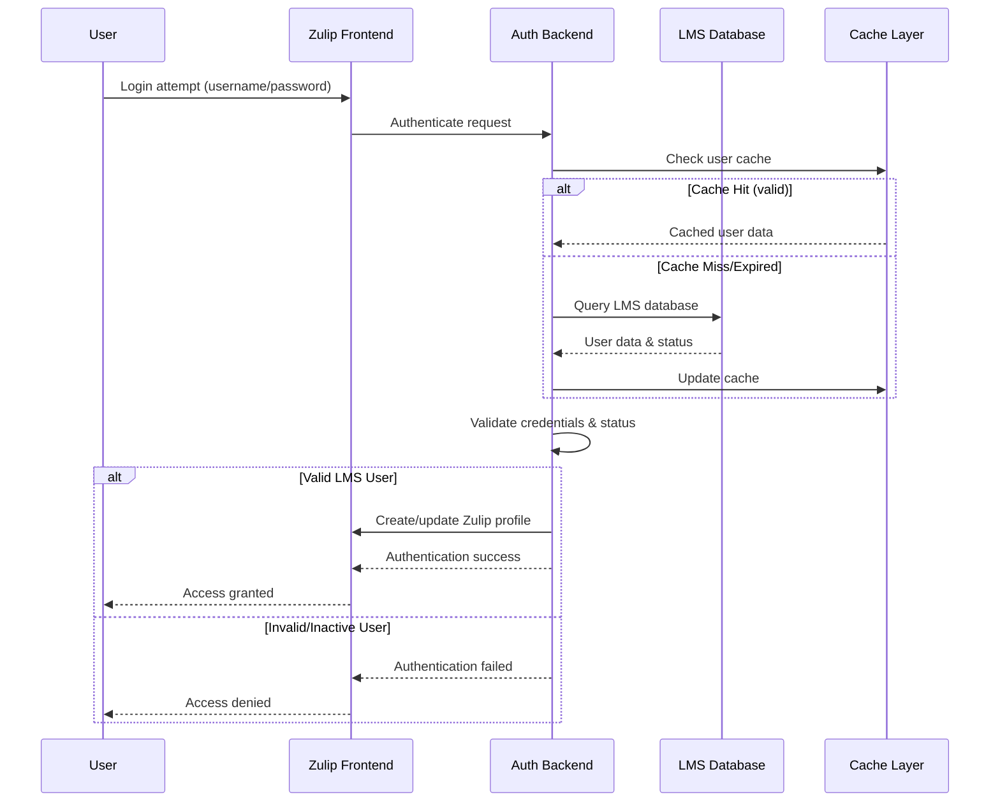

# LMS-Zulip Authentication and Authorization Strategy

## Executive Summary

This document outlines the comprehensive authentication and authorization strategy for integrating your Learning Management System (LMS) with Zulip. The strategy ensures that **only authorized students and mentors from your LMS database can access Zulip**, maintaining strict access control and data security.

## Security Principles

### Core Security Requirements

1. **Single Source of Truth**: LMS database is the authoritative source for user authentication
2. **Real-time Validation**: User access is validated against LMS on each login attempt
3. **Automatic Deactivation**: Users removed from LMS are immediately blocked from Zulip
4. **Role-Based Access**: Different permissions based on LMS user roles (student/mentor)
5. **Data Privacy**: Minimal data exposure with encrypted communications

## Authentication Architecture

### High-Level Authentication Flow



## Custom Authentication Backend

### LMS Authentication Backend Implementation

```python
from django.contrib.auth.backends import BaseBackend
from django.contrib.auth.models import User
from django.core.cache import cache
from django.db import connections
from django.conf import settings
from typing import Optional, Dict, Any
import hashlib
import logging

logger = logging.getLogger(__name__)

class LMSAuthenticationBackend(BaseBackend):
    """
    Custom authentication backend that validates users against LMS database
    """
    
    def authenticate(self, request, username=None, password=None, **kwargs) -> Optional[User]:
        """
        Authenticate user against LMS database
        """
        if not username or not password:
            return None
        
        try:
            # Check if user exists and is active in LMS
            lms_user = self._validate_lms_user(username, password)
            
            if not lms_user:
                logger.warning(f"Authentication failed for username: {username}")
                return None
            
            # Create or update Zulip user profile
            zulip_user = self._create_or_update_zulip_user(lms_user)
            
            # Cache successful authentication
            self._cache_user_authentication(username, lms_user)
            
            logger.info(f"Successful authentication for LMS user: {username}")
            return zulip_user
            
        except Exception as e:
            logger.error(f"Authentication error for user {username}: {str(e)}")
            return None
    
    def get_user(self, user_id: int) -> Optional[User]:
        """
        Retrieve user by ID with LMS validation
        """
        try:
            from zerver.models import UserProfile
            user_profile = UserProfile.objects.get(id=user_id)
            
            # Validate user is still active in LMS
            if self._is_user_active_in_lms(user_profile.delivery_email):
                return user_profile
            else:
                # User no longer active in LMS, deactivate Zulip account
                self._deactivate_zulip_user(user_profile)
                return None
                
        except UserProfile.DoesNotExist:
            return None
        except Exception as e:
            logger.error(f"Error retrieving user {user_id}: {str(e)}")
            return None
    
    def _validate_lms_user(self, username: str, password: str) -> Optional[Dict[str, Any]]:
        """
        Validate user credentials against LMS database
        """
        # Check cache first for performance
        cache_key = f"lms_auth_{hashlib.md5(username.encode()).hexdigest()}"
        cached_result = cache.get(cache_key)
        
        if cached_result and self._verify_password(password, cached_result.get('password_hash')):
            return cached_result
        
        # Query LMS database
        lms_connection = connections['lms']
        
        with lms_connection.cursor() as cursor:
            # Check students table
            cursor.execute("""
                SELECT id, username, email, first_name, last_name, 
                       display_name, password_hash, is_active, created
                FROM students 
                WHERE (username = %s OR email = %s) AND is_active = true
            """, [username, username])
            
            student_result = cursor.fetchone()
            
            if student_result:
                user_data = self._format_student_data(student_result)
                if self._verify_password(password, user_data['password_hash']):
                    user_data['role'] = 'student'
                    user_data['lms_user_type'] = 'student'
                    
                    # Cache successful validation
                    cache.set(cache_key, user_data, timeout=300)  # 5 minutes
                    return user_data
            
            # Check mentors table if not found in students
            cursor.execute("""
                SELECT id, username, email, first_name, last_name, 
                       display_name, created
                FROM mentors 
                WHERE (username = %s OR email = %s)
            """, [username, username])
            
            mentor_result = cursor.fetchone()
            
            if mentor_result:
                # For mentors, you might use a different password validation
                # or integrate with external authentication system
                user_data = self._format_mentor_data(mentor_result)
                user_data['role'] = 'mentor'
                user_data['lms_user_type'] = 'mentor'
                
                # For demo purposes - in production, implement proper mentor auth
                if self._validate_mentor_password(username, password):
                    cache.set(cache_key, user_data, timeout=300)
                    return user_data
        
        return None
    
    def _verify_password(self, plain_password: str, hashed_password: str) -> bool:
        """
        Verify password against hash (implement based on your LMS hashing method)
        """
        # This depends on how passwords are hashed in your LMS
        # Common methods: bcrypt, Django's PBKDF2, etc.
        
        # Example for Django-style password hashing:
        from django.contrib.auth.hashers import check_password
        return check_password(plain_password, hashed_password)
    
    def _create_or_update_zulip_user(self, lms_user: Dict[str, Any]) -> User:
        """
        Create or update Zulip user profile based on LMS data
        """
        from zerver.models import UserProfile, Realm
        from zerver.lib.actions import do_create_user, do_change_user_role
        
        email = lms_user['email']
        realm = self._get_or_create_lms_realm()
        
        try:
            # Try to get existing user
            user_profile = UserProfile.objects.get(
                delivery_email=email,
                realm=realm
            )
            
            # Update user information from LMS
            self._update_user_profile_from_lms(user_profile, lms_user)
            
        except UserProfile.DoesNotExist:
            # Create new user
            user_profile = self._create_new_user_from_lms(lms_user, realm)
        
        return user_profile
    
    def _get_or_create_lms_realm(self) -> 'Realm':
        """
        Get or create the realm for LMS users
        """
        from zerver.models import Realm
        
        realm_domain = settings.LMS_INTEGRATION_CONFIG.get('REALM_DOMAIN', 'lms.example.com')
        
        realm, created = Realm.objects.get_or_create(
            string_id=realm_domain.split('.')[0],
            defaults={
                'name': 'LMS Integration Realm',
                'description': 'Realm for LMS-integrated users',
                'restricted_to_domain': True,
                'invite_required': True,
            }
        )
        
        return realm
    
    def _create_new_user_from_lms(self, lms_user: Dict[str, Any], realm: 'Realm') -> 'UserProfile':
        """
        Create new Zulip user from LMS data
        """
        from zerver.lib.actions import do_create_user
        from zerver.models import UserProfile
        
        # Determine user role in Zulip based on LMS role
        role = UserProfile.ROLE_MEMBER
        if lms_user['role'] == 'mentor':
            role = UserProfile.ROLE_MODERATOR
        
        user_profile = do_create_user(
            email=lms_user['email'],
            password=None,  # Password handled by LMS auth
            realm=realm,
            full_name=f"{lms_user['first_name']} {lms_user['last_name']}",
            role=role,
            acting_user=None
        )
        
        # Store LMS-specific data
        self._store_lms_profile_data(user_profile, lms_user)
        
        return user_profile
    
    def _store_lms_profile_data(self, user_profile: 'UserProfile', lms_user: Dict[str, Any]) -> None:
        """
        Store LMS-specific profile data
        """
        from zerver.models import CustomProfileField, CustomProfileFieldValue
        
        # Create custom fields for LMS data if they don't exist
        lms_fields = {
            'lms_user_id': lms_user['id'],
            'lms_user_type': lms_user['lms_user_type'],
            'lms_username': lms_user['username'],
        }
        
        for field_name, field_value in lms_fields.items():
            try:
                custom_field, created = CustomProfileField.objects.get_or_create(
                    realm=user_profile.realm,
                    name=field_name,
                    defaults={'field_type': CustomProfileField.SHORT_TEXT}
                )
                
                CustomProfileFieldValue.objects.update_or_create(
                    user_profile=user_profile,
                    field=custom_field,
                    defaults={'value': str(field_value)}
                )
            except Exception as e:
                logger.warning(f"Failed to store LMS field {field_name}: {e}")
    
    def _is_user_active_in_lms(self, email: str) -> bool:
        """
        Check if user is still active in LMS
        """
        cache_key = f"lms_active_{hashlib.md5(email.encode()).hexdigest()}"
        cached_result = cache.get(cache_key)
        
        if cached_result is not None:
            return cached_result
        
        lms_connection = connections['lms']
        
        with lms_connection.cursor() as cursor:
            # Check students
            cursor.execute("""
                SELECT is_active FROM students WHERE email = %s
            """, [email])
            
            result = cursor.fetchone()
            if result:
                is_active = result[0]
                cache.set(cache_key, is_active, timeout=300)  # 5 minutes
                return is_active
            
            # Check mentors (assuming mentors are always active if they exist)
            cursor.execute("""
                SELECT id FROM mentors WHERE email = %s
            """, [email])
            
            mentor_exists = cursor.fetchone() is not None
            cache.set(cache_key, mentor_exists, timeout=300)
            return mentor_exists
        
        return False
```

## Authorization and Role Management

### Role-Based Access Control

```python
class LMSRoleManager:
    """
    Manages user roles and permissions based on LMS data
    """
    
    def __init__(self):
        self.role_mappings = {
            'student': {
                'zulip_role': UserProfile.ROLE_MEMBER,
                'permissions': [
                    'send_messages',
                    'read_messages',
                    'create_streams',  # Limited stream creation
                ],
                'restrictions': [
                    'no_admin_access',
                    'limited_user_management',
                ]
            },
            'mentor': {
                'zulip_role': UserProfile.ROLE_MODERATOR,
                'permissions': [
                    'send_messages',
                    'read_messages',
                    'create_streams',
                    'manage_students',
                    'moderate_content',
                    'access_analytics',
                ],
                'restrictions': [
                    'no_realm_admin',
                    'student_scope_only',  # Can only manage their assigned students
                ]
            }
        }
    
    def assign_user_permissions(self, user_profile: UserProfile, lms_role: str) -> None:
        """
        Assign permissions based on LMS role
        """
        role_config = self.role_mappings.get(lms_role, self.role_mappings['student'])
        
        # Set Zulip role
        user_profile.role = role_config['zulip_role']
        user_profile.save()
        
        # Apply custom permissions
        self._apply_custom_permissions(user_profile, role_config)
    
    def _apply_custom_permissions(self, user_profile: UserProfile, role_config: Dict) -> None:
        """
        Apply custom permissions based on role configuration
        """
        # Implementation would depend on your specific permission requirements
        # This could involve custom permission models or middleware
        pass
    
    def validate_mentor_student_relationship(self, mentor_id: int, student_id: int) -> bool:
        """
        Validate that mentor is authorized to interact with specific student
        """
        lms_connection = connections['lms']
        
        with lms_connection.cursor() as cursor:
            cursor.execute("""
                SELECT 1 FROM _MentorToStudent 
                WHERE A = %s AND B = %s
            """, [mentor_id, student_id])
            
            return cursor.fetchone() is not None
```

### Access Control Middleware

```python
class LMSAccessControlMiddleware:
    """
    Middleware to enforce LMS-based access control
    """
    
    def __init__(self, get_response):
        self.get_response = get_response
    
    def __call__(self, request):
        # Validate user access before processing request
        if request.user.is_authenticated:
            if not self._validate_user_access(request.user):
                from django.contrib.auth import logout
                logout(request)
                return redirect('login')
        
        response = self.get_response(request)
        return response
    
    def _validate_user_access(self, user: UserProfile) -> bool:
        """
        Validate user still has access based on LMS status
        """
        # Check cache first
        cache_key = f"user_access_{user.id}"
        cached_result = cache.get(cache_key)
        
        if cached_result is not None:
            return cached_result
        
        # Validate against LMS
        backend = LMSAuthenticationBackend()
        is_valid = backend._is_user_active_in_lms(user.delivery_email)
        
        # Cache result
        cache.set(cache_key, is_valid, timeout=600)  # 10 minutes
        
        return is_valid
```

## User Lifecycle Management

### Automated User Management

```python
class LMSUserLifecycleManager:
    """
    Manages user lifecycle based on LMS changes
    """
    
    def __init__(self):
        self.sync_service = LMSDataSyncService()
    
    def sync_user_status_changes(self) -> Dict[str, Any]:
        """
        Sync user status changes from LMS
        """
        try:
            # Get users with recent status changes
            changed_users = self._get_users_with_status_changes()
            
            results = {
                'activated': 0,
                'deactivated': 0,
                'updated': 0,
                'errors': []
            }
            
            for lms_user in changed_users:
                try:
                    if lms_user['is_active']:
                        self._activate_or_create_user(lms_user)
                        results['activated'] += 1
                    else:
                        self._deactivate_user(lms_user)
                        results['deactivated'] += 1
                        
                except Exception as e:
                    results['errors'].append({
                        'user_id': lms_user['id'],
                        'error': str(e)
                    })
            
            return results
            
        except Exception as e:
            logger.error(f"User lifecycle sync failed: {e}")
            return {'error': str(e)}
    
    def _get_users_with_status_changes(self, since_hours: int = 1) -> List[Dict]:
        """
        Get users with recent status changes from LMS
        """
        lms_connection = connections['lms']
        since_timestamp = timezone.now() - timedelta(hours=since_hours)
        
        with lms_connection.cursor() as cursor:
            # Get changed students
            cursor.execute("""
                SELECT id, username, email, first_name, last_name, 
                       display_name, is_active, modified
                FROM students 
                WHERE modified >= %s
            """, [since_timestamp])
            
            students = [self._format_student_data(row) for row in cursor.fetchall()]
            
            # Get changed mentors
            cursor.execute("""
                SELECT id, username, email, first_name, last_name, 
                       display_name, modified
                FROM mentors 
                WHERE modified >= %s
            """, [since_timestamp])
            
            mentors = [self._format_mentor_data(row) for row in cursor.fetchall()]
            
            return students + mentors
    
    def _deactivate_user(self, lms_user: Dict) -> None:
        """
        Deactivate Zulip user when removed from LMS
        """
        from zerver.lib.actions import do_deactivate_user
        
        try:
            user_profile = UserProfile.objects.get(
                delivery_email=lms_user['email']
            )
            
            if user_profile.is_active:
                do_deactivate_user(user_profile, acting_user=None)
                logger.info(f"Deactivated user: {lms_user['email']}")
                
                # Clear user caches
                self._clear_user_caches(user_profile)
                
        except UserProfile.DoesNotExist:
            # User doesn't exist in Zulip, nothing to deactivate
            pass
    
    def _clear_user_caches(self, user_profile: UserProfile) -> None:
        """
        Clear all cached data for deactivated user
        """
        cache_keys = [
            f"user_access_{user_profile.id}",
            f"lms_active_{hashlib.md5(user_profile.delivery_email.encode()).hexdigest()}",
            f"lms_auth_{hashlib.md5(user_profile.delivery_email.encode()).hexdigest()}",
        ]
        
        cache.delete_many(cache_keys)
```

## Security Enhancements

### Additional Security Measures

```python
class LMSSecurityEnforcer:
    """
    Additional security measures for LMS integration
    """
    
    def __init__(self):
        self.failed_login_tracker = {}
        self.max_failed_attempts = 5
        self.lockout_duration = timedelta(minutes=15)
    
    def check_rate_limiting(self, username: str, ip_address: str) -> bool:
        """
        Check if user/IP should be rate limited
        """
        # Check user-based rate limiting
        user_key = f"login_attempts_{username}"
        user_attempts = cache.get(user_key, 0)
        
        if user_attempts >= self.max_failed_attempts:
            return False
        
        # Check IP-based rate limiting
        ip_key = f"login_attempts_ip_{ip_address}"
        ip_attempts = cache.get(ip_key, 0)
        
        if ip_attempts >= self.max_failed_attempts * 3:  # More lenient for IP
            return False
        
        return True
    
    def record_failed_login(self, username: str, ip_address: str) -> None:
        """
        Record failed login attempt
        """
        # Record user attempt
        user_key = f"login_attempts_{username}"
        user_attempts = cache.get(user_key, 0) + 1
        cache.set(user_key, user_attempts, timeout=self.lockout_duration.total_seconds())
        
        # Record IP attempt
        ip_key = f"login_attempts_ip_{ip_address}"
        ip_attempts = cache.get(ip_key, 0) + 1
        cache.set(ip_key, ip_attempts, timeout=self.lockout_duration.total_seconds())
        
        # Log security event
        logger.warning(f"Failed login attempt for {username} from {ip_address}")
    
    def validate_session_security(self, request) -> bool:
        """
        Additional session security validation
        """
        if not request.user.is_authenticated:
            return True
        
        # Check session age
        session_start = request.session.get('login_timestamp')
        if session_start:
            session_age = timezone.now() - datetime.fromisoformat(session_start)
            max_session_age = timedelta(hours=12)  # Force re-auth after 12 hours
            
            if session_age > max_session_age:
                return False
        
        # Check if user is still active in LMS
        backend = LMSAuthenticationBackend()
        if not backend._is_user_active_in_lms(request.user.delivery_email):
            return False
        
        return True
```

## Configuration and Deployment

### Authentication Configuration

```python
# settings.py additions for LMS authentication

# Authentication backends
AUTHENTICATION_BACKENDS = [
    'zerver.lib.auth.LMSAuthenticationBackend',  # Primary LMS auth
    'zerver.lib.auth.EmailAuthBackend',          # Fallback for system accounts
]

# LMS Integration Configuration
LMS_INTEGRATION_CONFIG = {
    # Database connection for LMS
    'LMS_DATABASE_ALIAS': 'lms',
    
    # Realm configuration
    'REALM_DOMAIN': env('LMS_REALM_DOMAIN', default='lms.yourcompany.com'),
    'AUTO_CREATE_REALM': env.bool('LMS_AUTO_CREATE_REALM', default=True),
    
    # Authentication settings
    'ENFORCE_LMS_AUTH_ONLY': env.bool('LMS_ENFORCE_AUTH_ONLY', default=True),
    'CACHE_USER_STATUS_SECONDS': env.int('LMS_CACHE_USER_STATUS', default=300),
    'SESSION_TIMEOUT_HOURS': env.int('LMS_SESSION_TIMEOUT', default=12),
    
    # Security settings
    'MAX_LOGIN_ATTEMPTS': env.int('LMS_MAX_LOGIN_ATTEMPTS', default=5),
    'LOCKOUT_DURATION_MINUTES': env.int('LMS_LOCKOUT_DURATION', default=15),
    'ENABLE_IP_RATE_LIMITING': env.bool('LMS_ENABLE_IP_RATE_LIMITING', default=True),
    
    # User lifecycle management
    'AUTO_SYNC_USER_STATUS': env.bool('LMS_AUTO_SYNC_USER_STATUS', default=True),
    'SYNC_INTERVAL_MINUTES': env.int('LMS_SYNC_INTERVAL', default=60),
    'AUTO_DEACTIVATE_REMOVED_USERS': env.bool('LMS_AUTO_DEACTIVATE', default=True),
}

# Middleware configuration
MIDDLEWARE = [
    # ... other middleware ...
    'zerver.middleware.LMSAccessControlMiddleware',
    # ... rest of middleware ...
]

# Database configuration for LMS
DATABASES['lms'] = {
    'ENGINE': 'django.db.backends.postgresql',
    'NAME': env('LMS_DATABASE_NAME'),
    'USER': env('LMS_DATABASE_USER'),
    'PASSWORD': env('LMS_DATABASE_PASSWORD'),
    'HOST': env('LMS_DATABASE_HOST'),
    'PORT': env('LMS_DATABASE_PORT', default='5432'),
    'OPTIONS': {
        'connect_timeout': 10,
        'sslmode': 'require',
    }
}

# Database routing
DATABASE_ROUTERS = ['zerver.lib.db_routing.LMSDBRouter']
```

### Database Router

```python
class LMSDBRouter:
    """
    Database router for LMS integration
    """
    
    lms_app_labels = {'lms_integration'}
    
    def db_for_read(self, model, **hints):
        """Suggest the database to read from"""
        if model._meta.app_label in self.lms_app_labels:
            return 'lms'
        return None
    
    def db_for_write(self, model, **hints):
        """Suggest the database to write to"""
        if model._meta.app_label in self.lms_app_labels:
            return 'lms'
        return None
    
    def allow_relation(self, obj1, obj2, **hints):
        """Allow relations if models are in the same app"""
        db_set = {'default', 'lms'}
        if obj1._state.db in db_set and obj2._state.db in db_set:
            return True
        return None
    
    def allow_migrate(self, db, app_label, model_name=None, **hints):
        """Ensure that certain apps' models get created on the right database"""
        if app_label in self.lms_app_labels:
            return db == 'lms'
        elif db == 'lms':
            return False
        return None
```

## Monitoring and Auditing

### Authentication Monitoring

```python
class LMSAuthenticationMonitor:
    """
    Monitor authentication events for security and analytics
    """
    
    def log_authentication_event(self, event_type: str, username: str, 
                                ip_address: str, success: bool, 
                                additional_data: Dict = None) -> None:
        """
        Log authentication events for monitoring
        """
        event_data = {
            'timestamp': timezone.now().isoformat(),
            'event_type': event_type,
            'username': username,
            'ip_address': ip_address,
            'success': success,
            'user_agent': additional_data.get('user_agent') if additional_data else None,
            'lms_user_type': additional_data.get('lms_user_type') if additional_data else None,
        }
        
        # Log to Django logger
        if success:
            logger.info(f"Authentication success: {json.dumps(event_data)}")
        else:
            logger.warning(f"Authentication failure: {json.dumps(event_data)}")
        
        # Send to analytics system if configured
        self._send_to_analytics(event_data)
    
    def generate_security_report(self, days: int = 7) -> Dict[str, Any]:
        """
        Generate security report for authentication events
        """
        # This would query your logging system for authentication events
        # and generate a comprehensive security report
        return {
            'total_login_attempts': 0,
            'successful_logins': 0,
            'failed_logins': 0,
            'unique_users': 0,
            'top_failure_reasons': [],
            'suspicious_activities': [],
            'recommendations': []
        }
```

## Benefits of This Authentication Strategy

### Security Benefits:
- **Single Source of Truth**: LMS database controls all access
- **Real-time Validation**: Immediate deactivation when removed from LMS
- **Role-Based Security**: Appropriate permissions based on LMS roles
- **Comprehensive Monitoring**: Full audit trail of authentication events

### Operational Benefits:
- **Automated Management**: Users automatically synchronized with LMS
- **Reduced Administration**: No separate user management needed
- **Consistent Experience**: Same credentials work for LMS and Zulip
- **Scalable Solution**: Handles large user populations efficiently

### Compliance Benefits:
- **Data Privacy**: Minimal data exposure with encrypted connections
- **Access Control**: Strict enforcement of authorized access only
- **Audit Trail**: Complete logging of all authentication events
- **Regulatory Compliance**: Supports FERPA, GDPR, and other requirements

This comprehensive authentication strategy ensures that your Zulip integration maintains the highest security standards while providing a seamless experience for authorized LMS users.
