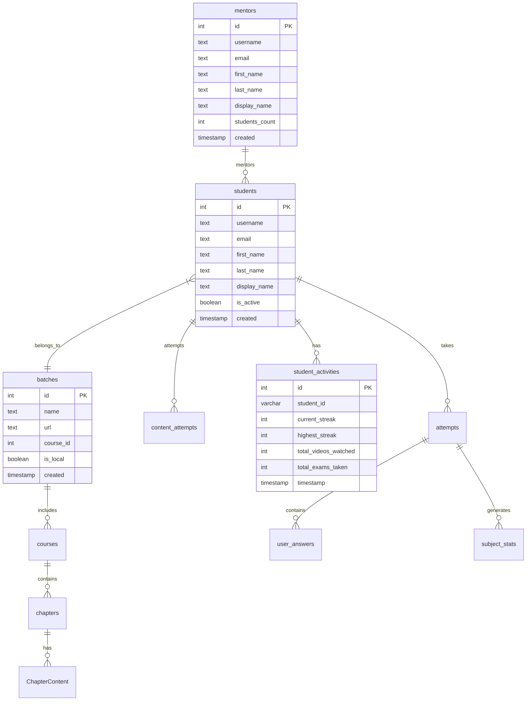
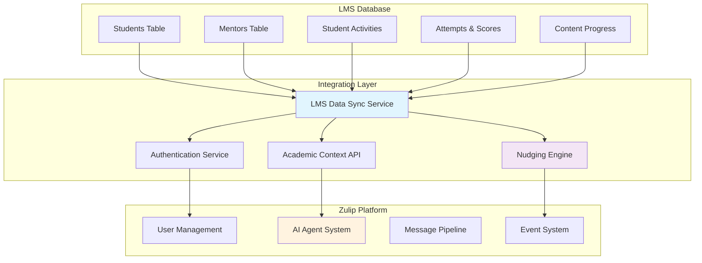
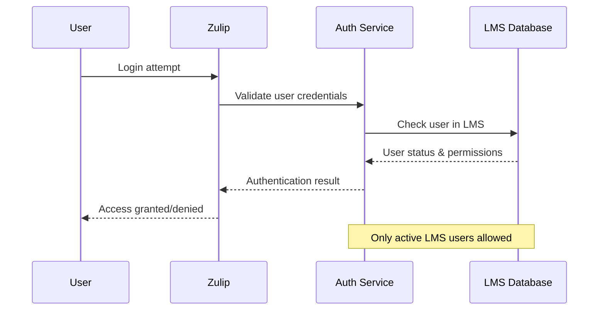

# LMS-Zulip Integration Architecture

## Executive Summary

This document outlines the comprehensive integration architecture between your Learning Management System (LMS) database and Zulip messaging platform. The integration provides:

- **Secure Authentication**: Only authorized students and mentors from your LMS can access Zulip
- **Academic Context**: Enhanced AI agent responses using real student performance data
- **Intelligent Nudging**: Automated engagement system based on learning patterns
- **Unified Experience**: Seamless transition between LMS learning and Zulip communication

## LMS Database Schema Analysis

### Core Entities and Relationships

Based on your database schema, the key entities for Zulip integration are:



### Key Data Points for Integration

**Student Profile Data:**
- Academic performance metrics (scores, percentiles, streaks)
- Learning engagement patterns (videos watched, exams taken)
- Course progress and content completion
- Batch and mentor associations

**Academic Performance Data:**
- Exam attempts and scores
- Subject-wise performance statistics  
- Difficulty level analysis
- Time spent on content

**Engagement Metrics:**
- Daily activity streaks
- Video watch completion rates
- Assignment submission patterns
- Conference attendance

## Integration Architecture

### High-Level System Design



### Component Architecture

#### 1. LMS Data Sync Service

**Purpose**: Maintains synchronized copy of essential LMS data in Zulip

**Key Components:**
- **Data Replication**: Real-time or batch sync of student/mentor data
- **Change Detection**: Monitors LMS for updates to user status, performance
- **Data Validation**: Ensures data integrity and consistency
- **Caching Layer**: High-performance access to frequently used data

**Implementation Strategy:**
```python
class LMSDataSyncService:
    """
    Service for synchronizing LMS data with Zulip
    
    Features:
    - Incremental sync based on modification timestamps
    - Batch processing for performance
    - Conflict resolution for data updates
    - Automated retry mechanisms
    """
    
    def sync_students(self, since: datetime = None) -> SyncResult:
        """Sync student data from LMS"""
        
    def sync_mentors(self, since: datetime = None) -> SyncResult:
        """Sync mentor data from LMS"""
        
    def sync_academic_data(self, student_ids: List[int] = None) -> SyncResult:
        """Sync performance and activity data"""
```

#### 2. Authentication & Authorization Service

**Purpose**: Ensures only authorized LMS users can access Zulip

**Authentication Flow:**


**Key Features:**
- **Single Source of Truth**: LMS database determines user access
- **Real-time Validation**: Check user status on each login
- **Role Mapping**: Map LMS roles to Zulip permissions
- **Account Lifecycle**: Auto-disable when removed from LMS

#### 3. Academic Context API

**Purpose**: Provides rich academic context to AI agents and other services

**Data Services:**
```python
class AcademicContextAPI:
    """
    API for accessing student academic context
    """
    
    def get_student_profile(self, student_id: int) -> StudentProfile:
        """Get comprehensive student academic profile"""
        return {
            'performance_metrics': {
                'current_streak': 15,
                'highest_streak': 45,
                'average_score': 85.5,
                'percentile_rank': 78,
                'total_exams': 12,
                'videos_watched': 156
            },
            'current_courses': [...],
            'struggling_subjects': ['Physics', 'Mathematics'],
            'strong_subjects': ['Chemistry', 'Biology'],
            'recent_activity': {...}
        }
    
    def get_mentor_context(self, mentor_id: int) -> MentorContext:
        """Get mentor's student performance overview"""
        
    def get_learning_patterns(self, student_id: int) -> LearningPatterns:
        """Analyze student learning behavior patterns"""
```

### Database Integration Strategy

#### Option 1: Direct Database Connection (Recommended)

**Pros:**
- Real-time data access
- No sync delays
- Minimal data duplication
- Lower maintenance overhead

**Cons:**
- Database coupling
- Network dependency
- Potential performance impact

**Implementation:**
```python
# settings.py
DATABASES = {
    'default': {
        # Zulip database
    },
    'lms': {
        'ENGINE': 'django.db.backends.postgresql',
        'NAME': 'lms_database',
        'USER': 'zulip_readonly',
        'HOST': 'lms-db.example.com',
        'OPTIONS': {
            'connect_timeout': 10,
        }
    }
}

DATABASE_ROUTERS = ['zerver.lib.lms_db_router.LMSDBRouter']
```

#### Option 2: Synchronized Data Store

**Pros:**
- Performance isolation
- Offline capability
- Data transformation flexibility
- Reduced LMS database load

**Cons:**
- Data synchronization complexity
- Potential data staleness
- Storage overhead
- Sync failure handling

## Security and Privacy Considerations

### Data Access Controls

**Principle of Least Privilege:**
- Zulip only accesses necessary LMS data
- Read-only access to LMS database
- Encrypted connections (TLS/SSL)
- Regular access audits

**Privacy Protection:**
- No sensitive personal data stored in Zulip
- Academic data encrypted at rest
- GDPR/FERPA compliance considerations
- User consent for data usage

### Authentication Security

**Multi-layered Validation:**
```python
class LMSAuthenticationBackend:
    """
    Custom authentication backend for LMS integration
    """
    
    def authenticate(self, request, username=None, password=None, **kwargs):
        # 1. Validate against LMS database
        # 2. Check user active status
        # 3. Verify batch/mentor assignments
        # 4. Create/update Zulip user profile
        # 5. Set appropriate permissions
```

## Data Models and Extensions

### Extended Zulip User Models

```python
class LMSStudentProfile(models.Model):
    """
    Extended profile for LMS students
    """
    user_profile = models.OneToOneField(UserProfile, on_delete=models.CASCADE)
    lms_student_id = models.IntegerField(unique=True)
    current_batch_id = models.IntegerField()
    mentor_id = models.IntegerField()
    academic_year = models.CharField(max_length=10)
    enrollment_date = models.DateTimeField()
    
    # Cached performance metrics
    current_streak = models.IntegerField(default=0)
    highest_streak = models.IntegerField(default=0)
    average_score = models.FloatField(null=True)
    percentile_rank = models.FloatField(null=True)
    
    # Last sync timestamp
    last_synced = models.DateTimeField(auto_now=True)

class LMSMentorProfile(models.Model):
    """
    Extended profile for LMS mentors
    """
    user_profile = models.OneToOneField(UserProfile, on_delete=models.CASCADE)
    lms_mentor_id = models.IntegerField(unique=True)
    student_count = models.IntegerField(default=0)
    specialization = models.CharField(max_length=100, blank=True)
    
    # Cached metrics
    last_synced = models.DateTimeField(auto_now=True)

class StudentAcademicSnapshot(models.Model):
    """
    Periodic snapshots of student academic performance
    """
    student_profile = models.ForeignKey(LMSStudentProfile, on_delete=models.CASCADE)
    snapshot_date = models.DateTimeField()
    
    # Performance metrics at snapshot time
    total_exams_taken = models.IntegerField()
    average_score = models.FloatField()
    videos_watched = models.IntegerField()
    streak_count = models.IntegerField()
    
    # Subject-wise performance
    subject_scores = models.JSONField()  # {"Physics": 75, "Math": 82, ...}
    
    class Meta:
        unique_together = ['student_profile', 'snapshot_date']
```

### LMS Database Access Models

```python
class LMSStudent(models.Model):
    """
    Read-only model for LMS students table
    """
    id = models.IntegerField(primary_key=True)
    username = models.CharField(max_length=255)
    email = models.EmailField()
    first_name = models.CharField(max_length=255)
    last_name = models.CharField(max_length=255)
    is_active = models.BooleanField()
    created = models.DateTimeField()
    
    class Meta:
        managed = False
        db_table = 'students'
        app_label = 'lms_integration'

class LMSMentor(models.Model):
    """
    Read-only model for LMS mentors table
    """
    id = models.IntegerField(primary_key=True)
    username = models.CharField(max_length=255)
    email = models.EmailField()
    first_name = models.CharField(max_length=255)
    last_name = models.CharField(max_length=255)
    students_count = models.IntegerField()
    
    class Meta:
        managed = False
        db_table = 'mentors'
        app_label = 'lms_integration'

# Additional models for batches, student_activities, attempts, etc.
```

## API Design

### LMS Integration REST API

```python
# urls.py
urlpatterns = [
    path('api/v1/lms/students/<int:student_id>/profile/', 
         StudentProfileView.as_view()),
    path('api/v1/lms/students/<int:student_id>/performance/', 
         StudentPerformanceView.as_view()),
    path('api/v1/lms/mentors/<int:mentor_id>/students/', 
         MentorStudentsView.as_view()),
    path('api/v1/lms/sync/students/', 
         SyncStudentsView.as_view()),
]

class StudentProfileView(APIView):
    """
    Get comprehensive student profile including academic data
    """
    def get(self, request, student_id):
        return Response({
            'student_info': {...},
            'academic_metrics': {...},
            'current_courses': [...],
            'recent_performance': {...}
        })

class StudentPerformanceView(APIView):
    """
    Get detailed student performance analytics
    """
    def get(self, request, student_id):
        return Response({
            'exam_history': [...],
            'subject_performance': {...},
            'learning_patterns': {...},
            'recommendations': [...]
        })
```

### GraphQL API (Alternative)

```python
import graphene
from graphene_django import DjangoObjectType

class StudentType(DjangoObjectType):
    class Meta:
        model = LMSStudentProfile
        fields = "__all__"

class AcademicMetricsType(graphene.ObjectType):
    current_streak = graphene.Int()
    average_score = graphene.Float()
    percentile_rank = graphene.Float()
    total_exams = graphene.Int()

class Query(graphene.ObjectType):
    student = graphene.Field(StudentType, id=graphene.Int(required=True))
    student_metrics = graphene.Field(
        AcademicMetricsType, 
        student_id=graphene.Int(required=True)
    )
    
    def resolve_student(self, info, id):
        return LMSStudentProfile.objects.get(lms_student_id=id)
    
    def resolve_student_metrics(self, info, student_id):
        # Query LMS database for real-time metrics
        pass

schema = graphene.Schema(query=Query)
```

## Performance Considerations

### Caching Strategy

**Multi-level Caching:**
```python
class LMSDataCache:
    """
    Intelligent caching for LMS data
    """
    
    # Level 1: In-memory cache for frequently accessed data
    MEMORY_CACHE_TTL = {
        'student_profile': 300,      # 5 minutes
        'academic_metrics': 600,     # 10 minutes
        'batch_info': 1800,          # 30 minutes
    }
    
    # Level 2: Redis cache for shared data
    REDIS_CACHE_TTL = {
        'student_performance': 3600,  # 1 hour
        'mentor_students': 1800,      # 30 minutes
        'course_progress': 900,       # 15 minutes
    }
    
    # Level 3: Database cache for complex queries
    DB_CACHE_TTL = {
        'performance_analytics': 7200,  # 2 hours
        'learning_patterns': 3600,      # 1 hour
    }
```

### Database Optimization

**Query Optimization:**
- Use database views for complex academic analytics
- Implement read replicas for LMS data access
- Create indexes on frequently queried fields
- Use connection pooling for database efficiency

**Example Optimized Queries:**
```sql
-- Create view for student performance summary
CREATE VIEW student_performance_summary AS
SELECT 
    s.id as student_id,
    s.username,
    sa.current_streak,
    sa.highest_streak,
    sa.total_exams_taken,
    sa.total_videos_watched,
    AVG(a.percentage) as avg_percentage,
    COUNT(a.id) as total_attempts
FROM students s
LEFT JOIN student_activities sa ON s.id::varchar = sa.student_id
LEFT JOIN attempts a ON s.id = a.user_id
WHERE s.is_active = true
GROUP BY s.id, s.username, sa.current_streak, sa.highest_streak, 
         sa.total_exams_taken, sa.total_videos_watched;

-- Index for performance
CREATE INDEX idx_student_performance ON attempts(user_id, date, percentage);
CREATE INDEX idx_student_activities ON student_activities(student_id, fetch_date);
```

## Error Handling and Resilience

### Fault Tolerance Strategy

```python
class LMSIntegrationService:
    """
    Resilient service for LMS integration
    """
    
    def __init__(self):
        self.circuit_breaker = CircuitBreaker(
            failure_threshold=5,
            recovery_timeout=30,
            expected_exception=DatabaseError
        )
    
    @retry(stop=stop_after_attempt(3), wait=wait_exponential(multiplier=1, min=4, max=10))
    def get_student_data(self, student_id: int) -> Dict:
        """Get student data with retry logic"""
        try:
            return self._fetch_from_lms(student_id)
        except DatabaseError as e:
            # Fallback to cached data
            logger.warning(f"LMS database unavailable, using cache: {e}")
            return self._get_cached_student_data(student_id)
        except Exception as e:
            logger.error(f"Unexpected error fetching student data: {e}")
            raise
    
    def _get_cached_student_data(self, student_id: int) -> Dict:
        """Fallback to cached data when LMS is unavailable"""
        cached_data = cache.get(f"student_data_{student_id}")
        if cached_data:
            return cached_data
        
        # Ultimate fallback to basic Zulip profile data
        return self._get_basic_profile_data(student_id)
```

### Monitoring and Alerting

**Key Metrics to Monitor:**
- LMS database connection health
- Data sync success/failure rates
- Authentication success rates
- API response times
- Cache hit/miss ratios

**Alert Conditions:**
- LMS database connection failures
- Sync job failures
- High authentication failure rates
- Performance degradation

## Next Steps and Implementation Phases

### Phase 1: Foundation (Weeks 1-2)
- [ ] Set up LMS database connection
- [ ] Implement basic authentication backend
- [ ] Create core data models
- [ ] Basic API endpoints

### Phase 2: Core Integration (Weeks 3-4)
- [ ] Student/mentor profile sync
- [ ] Academic context API
- [ ] Performance data integration
- [ ] Basic caching implementation

### Phase 3: AI Enhancement (Weeks 5-6)
- [ ] Integrate academic context with AI agents
- [ ] Enhanced response generation
- [ ] Performance-based suggestions
- [ ] Testing and optimization

### Phase 4: Advanced Features (Weeks 7-8)
- [ ] Nudging system implementation
- [ ] Advanced analytics
- [ ] Monitoring and alerting
- [ ] Production deployment

This architecture provides a robust foundation for integrating your LMS with Zulip while maintaining security, performance, and scalability.
