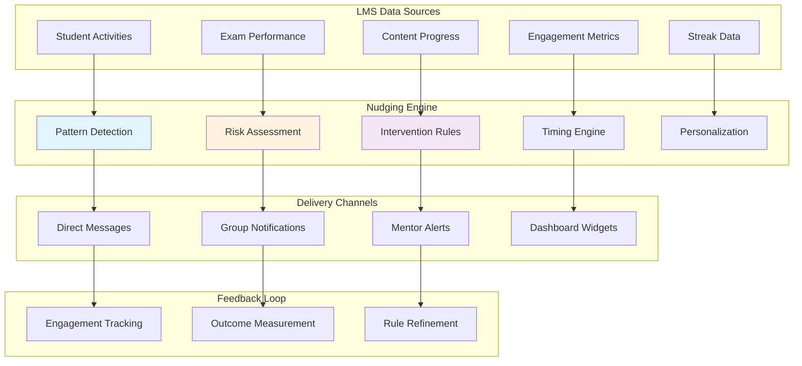

# LMS-Powered Intelligent Nudging System

## Executive Summary

The Intelligent Nudging System leverages rich academic data from your LMS to create a proactive student engagement platform within Zulip. The system automatically identifies at-risk students, detects learning patterns, and delivers timely, personalized interventions to improve academic outcomes.

## System Overview

### Core Concept

The nudging system operates on behavioral psychology principles, using academic data patterns to trigger contextual interventions that guide students toward better learning behaviors without being intrusive.

### Key Components



## Academic Data Analysis for Nudging

### Student Behavior Patterns

Based on your LMS schema, we can identify several key behavioral patterns:

#### 1. Engagement Patterns
```python
class EngagementPatternAnalyzer:
    """
    Analyzes student engagement patterns from LMS data
    """
    
    def analyze_engagement_trends(self, student_id: int, days: int = 30) -> Dict:
        """
        Analyze engagement trends over specified period
        """
        activities = self._get_student_activities(student_id, days)
        content_attempts = self._get_content_attempts(student_id, days)
        
        return {
            'daily_activity_pattern': self._analyze_daily_patterns(activities),
            'content_engagement': self._analyze_content_engagement(content_attempts),
            'streak_behavior': self._analyze_streak_behavior(activities),
            'video_completion_rate': self._calculate_video_completion_rate(content_attempts),
            'exam_participation_rate': self._calculate_exam_participation_rate(activities),
            'decline_indicators': self._detect_decline_indicators(activities, content_attempts)
        }
    
    def _detect_decline_indicators(self, activities: List, attempts: List) -> List[str]:
        """Detect early warning signs of disengagement"""
        indicators = []
        
        # Check for streak breaks
        if self._has_recent_streak_break(activities):
            indicators.append('streak_break')
        
        # Check for declining video watch time
        if self._has_declining_video_engagement(attempts):
            indicators.append('declining_video_engagement')
        
        # Check for missed assignments
        if self._has_missed_assignments(attempts):
            indicators.append('missed_assignments')
        
        # Check for irregular study patterns
        if self._has_irregular_study_pattern(activities):
            indicators.append('irregular_study_pattern')
        
        return indicators
```

#### 2. Performance Risk Assessment
```python
class PerformanceRiskAssessor:
    """
    Assesses academic performance risks using LMS data
    """
    
    def assess_student_risk(self, student_id: int) -> Dict:
        """
        Comprehensive risk assessment for a student
        """
        performance_data = self._get_performance_metrics(student_id)
        engagement_data = self._get_engagement_metrics(student_id)
        
        risk_factors = {
            'academic_performance': self._assess_academic_risk(performance_data),
            'engagement_risk': self._assess_engagement_risk(engagement_data),
            'subject_specific_risks': self._assess_subject_risks(performance_data),
            'behavioral_risks': self._assess_behavioral_risks(engagement_data)
        }
        
        overall_risk = self._calculate_overall_risk(risk_factors)
        
        return {
            'overall_risk_level': overall_risk,
            'risk_factors': risk_factors,
            'recommended_interventions': self._recommend_interventions(risk_factors),
            'urgency_level': self._calculate_urgency(overall_risk, risk_factors),
            'next_review_date': self._calculate_next_review(overall_risk)
        }
    
    def _assess_academic_risk(self, performance_data: Dict) -> Dict:
        """Assess risk based on academic performance"""
        risk_level = 'low'
        factors = []
        
        avg_score = performance_data.get('average_score', 100)
        percentile = performance_data.get('percentile_rank', 100)
        recent_scores = performance_data.get('recent_scores', [])
        
        # Score-based risk assessment
        if avg_score < 40:
            risk_level = 'critical'
            factors.append('very_low_average_score')
        elif avg_score < 60:
            risk_level = 'high'
            factors.append('low_average_score')
        elif avg_score < 75:
            risk_level = 'medium'
            factors.append('below_average_score')
        
        # Percentile-based risk
        if percentile < 25:
            factors.append('low_percentile_rank')
            if risk_level == 'low':
                risk_level = 'medium'
        
        # Trend analysis
        if len(recent_scores) >= 3:
            if self._is_declining_trend(recent_scores):
                factors.append('declining_performance_trend')
                risk_level = self._escalate_risk_level(risk_level)
        
        return {
            'level': risk_level,
            'factors': factors,
            'confidence': self._calculate_risk_confidence(performance_data)
        }
```

## Nudging Rules and Triggers

### Rule-Based Intervention System

```python
class NudgingRulesEngine:
    """
    Rules engine for determining when and how to nudge students
    """
    
    def __init__(self):
        self.rules = self._load_nudging_rules()
        self.cooldown_periods = self._load_cooldown_config()
    
    def evaluate_student_for_nudges(self, student_id: int) -> List[Dict]:
        """
        Evaluate all nudging rules for a student
        """
        student_context = self._build_student_context(student_id)
        applicable_nudges = []
        
        for rule in self.rules:
            if self._evaluate_rule_conditions(rule, student_context):
                if self._check_cooldown(student_id, rule['id']):
                    nudge = self._create_nudge_from_rule(rule, student_context)
                    applicable_nudges.append(nudge)
        
        # Prioritize and limit nudges
        return self._prioritize_nudges(applicable_nudges)
    
    def _load_nudging_rules(self) -> List[Dict]:
        """Load nudging rules configuration"""
        return [
            {
                'id': 'streak_break_recovery',
                'name': 'Streak Break Recovery',
                'conditions': {
                    'current_streak': {'equals': 0},
                    'highest_streak': {'greater_than': 5},
                    'days_since_last_activity': {'less_than': 3}
                },
                'intervention': {
                    'type': 'encouragement',
                    'message_template': 'streak_break_recovery',
                    'urgency': 'medium',
                    'delivery_method': 'direct_message'
                },
                'cooldown_hours': 24
            },
            {
                'id': 'low_performance_alert',
                'name': 'Low Performance Alert',
                'conditions': {
                    'average_score': {'less_than': 60},
                    'recent_exam_count': {'greater_than': 2},
                    'risk_level': {'in': ['high', 'critical']}
                },
                'intervention': {
                    'type': 'academic_support',
                    'message_template': 'low_performance_support',
                    'urgency': 'high',
                    'delivery_method': 'mentor_and_student',
                    'include_resources': True
                },
                'cooldown_hours': 72
            },
            {
                'id': 'video_completion_nudge',
                'name': 'Video Completion Encouragement',
                'conditions': {
                    'video_completion_rate': {'less_than': 0.5},
                    'videos_started': {'greater_than': 3},
                    'days_since_last_video': {'less_than': 7}
                },
                'intervention': {
                    'type': 'engagement',
                    'message_template': 'video_completion_nudge',
                    'urgency': 'low',
                    'delivery_method': 'direct_message'
                },
                'cooldown_hours': 48
            },
            {
                'id': 'exam_preparation_reminder',
                'name': 'Exam Preparation Reminder',
                'conditions': {
                    'upcoming_exam_days': {'less_than': 7},
                    'preparation_activity': {'less_than': 0.3},
                    'historical_exam_performance': {'less_than': 75}
                },
                'intervention': {
                    'type': 'preparation',
                    'message_template': 'exam_prep_reminder',
                    'urgency': 'high',
                    'delivery_method': 'direct_message',
                    'include_study_plan': True
                },
                'cooldown_hours': 24
            },
            {
                'id': 'subject_struggle_support',
                'name': 'Subject-Specific Struggle Support',
                'conditions': {
                    'struggling_subjects_count': {'greater_than': 1},
                    'subject_score_trend': {'equals': 'declining'},
                    'days_since_subject_activity': {'greater_than': 5}
                },
                'intervention': {
                    'type': 'subject_support',
                    'message_template': 'subject_struggle_support',
                    'urgency': 'medium',
                    'delivery_method': 'mentor_and_student',
                    'personalize_by_subject': True
                },
                'cooldown_hours': 96
            }
        ]
```

### Personalized Message Generation

```python
class NudgeMessageGenerator:
    """
    Generates personalized nudge messages based on student context
    """
    
    def __init__(self, llm_client: PortkeyLLMClient):
        self.llm_client = llm_client
        self.message_templates = self._load_message_templates()
    
    def generate_personalized_nudge(self, nudge_rule: Dict, student_context: Dict) -> Dict:
        """
        Generate a personalized nudge message
        """
        template_id = nudge_rule['intervention']['message_template']
        base_template = self.message_templates[template_id]
        
        # Create personalization context
        personalization_context = self._build_personalization_context(
            student_context, 
            nudge_rule
        )
        
        # Generate personalized message using AI
        personalized_message = self._generate_ai_personalized_message(
            base_template,
            personalization_context
        )
        
        return {
            'message': personalized_message,
            'delivery_method': nudge_rule['intervention']['delivery_method'],
            'urgency': nudge_rule['intervention']['urgency'],
            'include_resources': nudge_rule['intervention'].get('include_resources', False),
            'metadata': {
                'rule_id': nudge_rule['id'],
                'template_used': template_id,
                'personalization_factors': list(personalization_context.keys())
            }
        }
    
    def _generate_ai_personalized_message(self, template: Dict, context: Dict) -> str:
        """Generate AI-powered personalized message"""
        
        prompt = [
            {
                "role": "system",
                "content": f"""You are an AI mentor creating personalized nudge messages for students. 
                
Use this context to personalize the message:
{json.dumps(context, indent=2)}

Message should be:
- Encouraging and supportive
- Specific to the student's situation
- Action-oriented
- Brief but impactful (max 150 words)
- Natural and conversational
"""
            },
            {
                "role": "user",
                "content": f"""Create a personalized nudge message based on this template:

Template: {template['base_message']}
Tone: {template['tone']}
Goal: {template['goal']}

Personalize for the student's specific situation."""
            }
        ]
        
        response = self.llm_client.chat_completion(
            messages=prompt,
            temperature=0.7,
            max_tokens=200
        )
        
        if response["success"]:
            return response["content"]
        else:
            # Fallback to template-based generation
            return self._generate_template_message(template, context)
    
    def _load_message_templates(self) -> Dict:
        """Load message templates for different nudge types"""
        return {
            'streak_break_recovery': {
                'base_message': "I noticed your study streak was broken recently. Don't worry, it happens to everyone! Your highest streak of {highest_streak} days shows you have great discipline.",
                'tone': 'encouraging',
                'goal': 'motivate_streak_recovery',
                'call_to_action': 'Start a new streak today'
            },
            'low_performance_support': {
                'base_message': "I've noticed you might be struggling with recent exams. Your current average of {average_score}% is below your potential. Let's work together to improve this.",
                'tone': 'supportive',
                'goal': 'offer_academic_help',
                'call_to_action': 'Schedule a study session'
            },
            'video_completion_nudge': {
                'base_message': "You've started {videos_started} videos but completed only {completion_rate}%. Finishing videos completely helps with retention and exam performance.",
                'tone': 'gentle_reminder',
                'goal': 'improve_video_engagement',
                'call_to_action': 'Complete your pending videos'
            },
            'exam_prep_reminder': {
                'base_message': "You have an exam in {days_until_exam} days. Based on your preparation activity, you might benefit from more focused study time.",
                'tone': 'urgent_but_supportive',
                'goal': 'increase_exam_preparation',
                'call_to_action': 'Review the study plan'
            },
            'subject_struggle_support': {
                'base_message': "I see you're having challenges with {struggling_subjects}. Your scores in these areas have been declining. Let's create a targeted improvement plan.",
                'tone': 'problem_solving',
                'goal': 'address_subject_weaknesses',
                'call_to_action': 'Focus on weak subjects'
            }
        }
```

## Delivery and Timing System

### Intelligent Timing Engine

```python
class NudgeTimingEngine:
    """
    Determines optimal timing for nudge delivery
    """
    
    def __init__(self):
        self.timing_rules = self._load_timing_rules()
        self.student_preferences = self._load_student_preferences()
    
    def calculate_optimal_delivery_time(self, student_id: int, nudge: Dict) -> datetime:
        """
        Calculate the optimal time to deliver a nudge
        """
        # Get student's activity patterns
        activity_pattern = self._analyze_student_activity_pattern(student_id)
        
        # Get nudge urgency
        urgency = nudge.get('urgency', 'medium')
        
        # Calculate base delivery time
        if urgency == 'critical':
            # Deliver immediately
            return timezone.now()
        elif urgency == 'high':
            # Deliver within next active period (max 4 hours)
            return self._find_next_active_period(student_id, max_hours=4)
        elif urgency == 'medium':
            # Deliver at optimal engagement time
            return self._find_optimal_engagement_time(student_id)
        else:  # low urgency
            # Deliver at next regular study time
            return self._find_next_study_time(student_id)
    
    def _analyze_student_activity_pattern(self, student_id: int) -> Dict:
        """Analyze when student is most active"""
        activities = self._get_recent_activities(student_id, days=30)
        
        # Analyze hourly patterns
        hourly_activity = defaultdict(int)
        daily_activity = defaultdict(int)
        
        for activity in activities:
            hour = activity.timestamp.hour
            day = activity.timestamp.weekday()
            hourly_activity[hour] += 1
            daily_activity[day] += 1
        
        return {
            'most_active_hours': sorted(hourly_activity.items(), 
                                      key=lambda x: x[1], reverse=True)[:3],
            'most_active_days': sorted(daily_activity.items(), 
                                     key=lambda x: x[1], reverse=True)[:3],
            'average_daily_activity': sum(daily_activity.values()) / max(len(daily_activity), 1)
        }
    
    def _find_optimal_engagement_time(self, student_id: int) -> datetime:
        """Find the time when student is most likely to engage"""
        pattern = self._analyze_student_activity_pattern(student_id)
        
        # Get the most active hour
        most_active_hour = pattern['most_active_hours'][0][0] if pattern['most_active_hours'] else 14
        
        # Schedule for next occurrence of that hour
        now = timezone.now()
        target_time = now.replace(hour=most_active_hour, minute=0, second=0, microsecond=0)
        
        if target_time <= now:
            target_time += timedelta(days=1)
        
        return target_time
```

### Multi-Channel Delivery System

```python
class NudgeDeliverySystem:
    """
    Handles delivery of nudges across multiple channels
    """
    
    def __init__(self):
        self.delivery_channels = {
            'direct_message': self._deliver_direct_message,
            'mentor_alert': self._deliver_mentor_alert,
            'mentor_and_student': self._deliver_to_both,
            'group_notification': self._deliver_group_notification,
            'dashboard_widget': self._update_dashboard_widget
        }
    
    def deliver_nudge(self, student_id: int, mentor_id: int, nudge: Dict) -> Dict:
        """
        Deliver nudge through appropriate channels
        """
        delivery_method = nudge.get('delivery_method', 'direct_message')
        
        try:
            delivery_result = self.delivery_channels[delivery_method](
                student_id, mentor_id, nudge
            )
            
            # Track delivery
            self._track_nudge_delivery(student_id, nudge, delivery_result)
            
            return {
                'success': True,
                'delivery_method': delivery_method,
                'message_id': delivery_result.get('message_id'),
                'delivered_at': timezone.now().isoformat()
            }
            
        except Exception as e:
            logger.error(f"Failed to deliver nudge: {e}")
            return {
                'success': False,
                'error': str(e),
                'delivery_method': delivery_method
            }
    
    def _deliver_direct_message(self, student_id: int, mentor_id: int, nudge: Dict) -> Dict:
        """Deliver nudge as direct message to student"""
        student = UserProfile.objects.get(id=student_id)
        mentor = UserProfile.objects.get(id=mentor_id)
        
        # Create the nudge message
        message_content = self._format_nudge_message(nudge)
        
        # Send as DM from mentor to student
        message_id = self._send_internal_message(
            sender=mentor,
            recipient=student,
            content=message_content,
            message_type='nudge'
        )
        
        return {'message_id': message_id, 'channel': 'direct_message'}
    
    def _deliver_mentor_alert(self, student_id: int, mentor_id: int, nudge: Dict) -> Dict:
        """Deliver alert to mentor about student"""
        mentor = UserProfile.objects.get(id=mentor_id)
        student = UserProfile.objects.get(id=student_id)
        
        alert_content = self._format_mentor_alert(student, nudge)
        
        message_id = self._send_internal_message(
            sender=None,  # System message
            recipient=mentor,
            content=alert_content,
            message_type='mentor_alert'
        )
        
        return {'message_id': message_id, 'channel': 'mentor_alert'}
    
    def _deliver_to_both(self, student_id: int, mentor_id: int, nudge: Dict) -> Dict:
        """Deliver nudge to both student and mentor"""
        student_result = self._deliver_direct_message(student_id, mentor_id, nudge)
        mentor_result = self._deliver_mentor_alert(student_id, mentor_id, nudge)
        
        return {
            'student_message_id': student_result['message_id'],
            'mentor_message_id': mentor_result['message_id'],
            'channel': 'both'
        }
```

## Advanced Nudging Strategies

### Adaptive Nudging Based on Response

```python
class AdaptiveNudgingSystem:
    """
    Adaptive nudging system that learns from student responses
    """
    
    def __init__(self):
        self.response_tracker = NudgeResponseTracker()
        self.effectiveness_analyzer = NudgeEffectivenessAnalyzer()
    
    def adapt_nudging_strategy(self, student_id: int) -> Dict:
        """
        Adapt nudging strategy based on historical effectiveness
        """
        response_history = self.response_tracker.get_student_response_history(student_id)
        effectiveness_data = self.effectiveness_analyzer.analyze_effectiveness(response_history)
        
        # Determine optimal nudging approach
        optimal_strategy = self._determine_optimal_strategy(effectiveness_data)
        
        # Update student nudging preferences
        self._update_student_nudging_profile(student_id, optimal_strategy)
        
        return optimal_strategy
    
    def _determine_optimal_strategy(self, effectiveness_data: Dict) -> Dict:
        """Determine optimal nudging strategy for student"""
        
        # Analyze which types of nudges work best
        most_effective_types = effectiveness_data.get('most_effective_types', [])
        optimal_timing = effectiveness_data.get('optimal_timing', {})
        preferred_tone = effectiveness_data.get('preferred_tone', 'encouraging')
        
        return {
            'preferred_nudge_types': most_effective_types,
            'optimal_delivery_hours': optimal_timing.get('hours', [14, 18, 20]),
            'preferred_tone': preferred_tone,
            'frequency_preference': effectiveness_data.get('optimal_frequency', 'medium'),
            'channel_preference': effectiveness_data.get('preferred_channels', ['direct_message'])
        }

class NudgeEffectivenessAnalyzer:
    """
    Analyzes the effectiveness of nudging interventions
    """
    
    def analyze_nudge_impact(self, student_id: int, nudge_id: str, 
                           follow_up_days: int = 7) -> Dict:
        """
        Analyze the impact of a specific nudge on student behavior
        """
        # Get baseline metrics before nudge
        baseline_metrics = self._get_baseline_metrics(student_id, nudge_id)
        
        # Get post-nudge metrics
        post_nudge_metrics = self._get_post_nudge_metrics(
            student_id, nudge_id, follow_up_days
        )
        
        # Calculate impact
        impact_analysis = self._calculate_impact(baseline_metrics, post_nudge_metrics)
        
        return {
            'nudge_id': nudge_id,
            'student_id': student_id,
            'baseline_metrics': baseline_metrics,
            'post_nudge_metrics': post_nudge_metrics,
            'impact_score': impact_analysis['overall_impact'],
            'specific_improvements': impact_analysis['improvements'],
            'effectiveness_rating': self._rate_effectiveness(impact_analysis),
            'recommendations': self._generate_recommendations(impact_analysis)
        }
    
    def _calculate_impact(self, baseline: Dict, post_nudge: Dict) -> Dict:
        """Calculate the impact of nudge on various metrics"""
        improvements = {}
        
        # Activity improvement
        if 'daily_activity' in baseline and 'daily_activity' in post_nudge:
            improvements['activity_change'] = (
                post_nudge['daily_activity'] - baseline['daily_activity']
            ) / max(baseline['daily_activity'], 1)
        
        # Performance improvement
        if 'average_score' in baseline and 'average_score' in post_nudge:
            improvements['performance_change'] = (
                post_nudge['average_score'] - baseline['average_score']
            ) / max(baseline['average_score'], 1)
        
        # Engagement improvement
        if 'engagement_rate' in baseline and 'engagement_rate' in post_nudge:
            improvements['engagement_change'] = (
                post_nudge['engagement_rate'] - baseline['engagement_rate']
            ) / max(baseline['engagement_rate'], 1)
        
        # Calculate overall impact
        overall_impact = sum(improvements.values()) / len(improvements) if improvements else 0
        
        return {
            'improvements': improvements,
            'overall_impact': overall_impact
        }
```

## Integration with Zulip Event System

### Nudge Event Handlers

```python
class NudgeEventSystem:
    """
    Integration with Zulip's event system for nudging
    """
    
    def __init__(self):
        self.nudge_scheduler = NudgeScheduler()
        self.delivery_system = NudgeDeliverySystem()
    
    def handle_student_activity_change(self, student_id: int, activity_data: Dict) -> None:
        """Handle changes in student activity patterns"""
        
        # Analyze the activity change
        activity_change = self._analyze_activity_change(student_id, activity_data)
        
        # Check if nudging is needed
        if activity_change.get('requires_intervention', False):
            nudges = self._generate_activity_based_nudges(student_id, activity_change)
            
            for nudge in nudges:
                self.nudge_scheduler.schedule_nudge(student_id, nudge)
    
    def handle_performance_update(self, student_id: int, performance_data: Dict) -> None:
        """Handle updates to student performance data"""
        
        # Check for significant performance changes
        performance_change = self._analyze_performance_change(student_id, performance_data)
        
        if performance_change.get('significant_decline', False):
            # Schedule urgent performance intervention
            urgent_nudge = self._create_performance_intervention_nudge(
                student_id, performance_change
            )
            self.nudge_scheduler.schedule_immediate_nudge(student_id, urgent_nudge)
        
        elif performance_change.get('improvement', False):
            # Schedule positive reinforcement
            positive_nudge = self._create_positive_reinforcement_nudge(
                student_id, performance_change
            )
            self.nudge_scheduler.schedule_nudge(student_id, positive_nudge)

# Event registration
def register_nudge_events():
    """Register nudging system with Zulip events"""
    
    event_system.register_handler('student_activity_updated', 
                                 NudgeEventSystem().handle_student_activity_change)
    
    event_system.register_handler('student_performance_updated', 
                                 NudgeEventSystem().handle_performance_update)
    
    event_system.register_handler('student_streak_broken', 
                                 handle_streak_break_nudge)
    
    event_system.register_handler('exam_deadline_approaching', 
                                 handle_exam_preparation_nudge)
```

## Dashboard and Analytics

### Nudging Analytics Dashboard

```python
class NudgingAnalyticsDashboard:
    """
    Analytics dashboard for nudging system performance
    """
    
    def get_system_overview(self, date_range: Tuple[datetime, datetime]) -> Dict:
        """Get overview of nudging system performance"""
        
        return {
            'total_nudges_sent': self._count_nudges_sent(date_range),
            'nudge_types_breakdown': self._get_nudge_types_breakdown(date_range),
            'response_rates': self._calculate_response_rates(date_range),
            'effectiveness_metrics': self._get_effectiveness_metrics(date_range),
            'top_performing_nudges': self._get_top_performing_nudges(date_range),
            'student_engagement_improvement': self._measure_engagement_improvement(date_range)
        }
    
    def get_student_nudging_report(self, student_id: int) -> Dict:
        """Get detailed nudging report for a specific student"""
        
        return {
            'student_profile': self._get_student_profile_summary(student_id),
            'nudges_received': self._get_student_nudge_history(student_id),
            'response_patterns': self._analyze_student_response_patterns(student_id),
            'effectiveness_by_type': self._analyze_effectiveness_by_type(student_id),
            'behavioral_changes': self._track_behavioral_changes(student_id),
            'recommended_adjustments': self._recommend_strategy_adjustments(student_id)
        }
    
    def get_mentor_impact_report(self, mentor_id: int) -> Dict:
        """Get report on nudging impact for mentor's students"""
        
        students = self._get_mentor_students(mentor_id)
        
        return {
            'mentor_profile': self._get_mentor_profile_summary(mentor_id),
            'students_overview': [self._get_student_summary(s.id) for s in students],
            'total_nudges_triggered': self._count_mentor_nudges(mentor_id),
            'intervention_success_rate': self._calculate_intervention_success_rate(mentor_id),
            'most_effective_strategies': self._identify_effective_strategies(mentor_id),
            'students_needing_attention': self._identify_at_risk_students(mentor_id)
        }
```

## Configuration and Customization

### Nudging System Configuration

```python
# settings.py additions for nudging system

NUDGING_SYSTEM_CONFIG = {
    # Enable/disable nudging system
    'ENABLE_NUDGING_SYSTEM': env.bool('ENABLE_NUDGING_SYSTEM', default=True),
    
    # Nudging frequency limits
    'MAX_NUDGES_PER_DAY': env.int('MAX_NUDGES_PER_DAY', default=3),
    'MAX_NUDGES_PER_WEEK': env.int('MAX_NUDGES_PER_WEEK', default=10),
    
    # Timing constraints
    'NUDGE_QUIET_HOURS_START': env.int('NUDGE_QUIET_HOURS_START', default=22),
    'NUDGE_QUIET_HOURS_END': env.int('NUDGE_QUIET_HOURS_END', default=8),
    'NUDGE_WEEKEND_ENABLED': env.bool('NUDGE_WEEKEND_ENABLED', default=False),
    
    # Risk thresholds
    'ACADEMIC_RISK_THRESHOLDS': {
        'critical': 0.9,
        'high': 0.7,
        'medium': 0.5,
        'low': 0.3
    },
    
    # Effectiveness tracking
    'NUDGE_EFFECTIVENESS_TRACKING_DAYS': env.int('NUDGE_TRACKING_DAYS', default=14),
    'MIN_RESPONSE_RATE_THRESHOLD': env.float('MIN_RESPONSE_RATE', default=0.3),
    
    # Personalization settings
    'ENABLE_AI_PERSONALIZATION': env.bool('ENABLE_AI_PERSONALIZATION', default=True),
    'PERSONALIZATION_CONFIDENCE_THRESHOLD': env.float('PERSONALIZATION_CONFIDENCE', default=0.7),
}

# Nudging rules configuration
NUDGING_RULES_CONFIG = {
    'RULES_FILE_PATH': env('NUDGING_RULES_FILE', default='config/nudging_rules.json'),
    'ENABLE_ADAPTIVE_RULES': env.bool('ENABLE_ADAPTIVE_RULES', default=True),
    'RULES_UPDATE_FREQUENCY_HOURS': env.int('RULES_UPDATE_FREQUENCY', default=24),
}
```

## Benefits and Expected Outcomes

### For Students:
- **Proactive Support**: Early intervention before academic problems escalate
- **Personalized Guidance**: Tailored recommendations based on learning patterns
- **Motivation Maintenance**: Timely encouragement to maintain engagement
- **Performance Improvement**: Data-driven insights for better academic outcomes

### For Mentors:
- **Early Warning System**: Automated alerts for at-risk students
- **Efficient Resource Allocation**: Focus attention where it's most needed
- **Data-Driven Insights**: Rich analytics on student engagement patterns
- **Reduced Workload**: Automated first-line student support

### For Institution:
- **Improved Retention**: Proactive intervention reduces dropout rates
- **Better Outcomes**: Data-driven approach improves overall academic performance
- **Scalable Support**: Automated system scales with student population
- **Evidence-Based Decisions**: Rich analytics inform policy and curriculum decisions

This comprehensive nudging system transforms your LMS data into actionable interventions that guide students toward academic success while providing mentors and administrators with powerful tools for student support.
